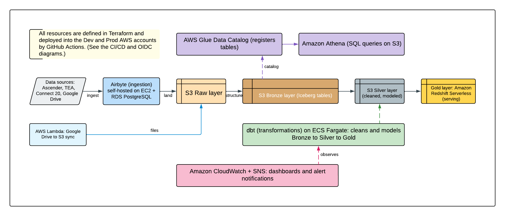

# Key Concepts & Glossary

This is the shared primer for the infrastructure knowledge-transfer (KT) docs. It is written for engineers who are **new to AWS, Terraform, and CI/CD**. Read this once, then keep it open as a reference while you work through the other KT documents. Wherever a term shows up in another doc, it links back here.

Related KT documents:

- [KT-01 — Infrastructure Repository Overview](kt-01-infrastructure-overview.md)
- [KT-02 — How to Make Infrastructure Changes](kt-02-making-infrastructure-changes.md)

## Part 1 — System Overview

*High-level view: code in GitHub drives GitHub Actions, which runs Terraform, which builds AWS resources across several accounts. The data platform ingests data, lands it in S3, catalogs it with Glue, and serves it through Athena, Redshift, and dbt.*

**1. The code lives in GitHub.** Everything that builds this platform is written as text files (mostly Terraform) and stored in a Git repository on GitHub: `esc-region-20/r20-data-lake-infrastructure`. Nothing is clicked together by hand in the AWS web console. If you want to change the infrastructure, you change the code.

**2. GitHub Actions runs the automation.** When you open a Pull Request (a proposed change), GitHub Actions (GitHub's built-in automation system) automatically runs Terraform in a temporary cloud machine to *preview* what your change would do. When the change is approved and merged, GitHub Actions runs Terraform again to *apply* it.

**3. Terraform creates the AWS resources.** Terraform reads the code and talks to the AWS API to create, update, or delete real cloud resources (networks, databases, storage buckets, permissions, and so on). It does this across **several separate AWS accounts**, one for shared services and CI, one for audit logs, one for security/identity, one for development (dev), and one for production (prod). Splitting work across accounts limits the blast radius if something goes wrong and keeps environments isolated.

**4. The data platform itself.** The resources Terraform builds form a data lake and warehouse. Data flows through it like this:

| Stage | What happens | Main AWS service |
|---|---|---|
| Ingest | Pull data in from external systems (databases, Google Drive, etc.) | **Airbyte** (plus some **Lambda** functions) |
| Store | Land the data in S3 across three layers: **raw**, **bronze**, **silver** | **S3** |
| Catalog | Discover the schema of files in S3 so they look like queryable tables | **Glue** (crawlers + Data Catalog), governed by **Lake Formation** |
| Query | Run SQL over the cataloged data | **Athena** (over S3) and **Redshift Serverless** (the GOLD layer) |
| Transform | Reshape and model the data into business-ready tables | **dbt** running on **ECS Fargate** |
| Watch | Track health, errors, and cost with dashboards and alerts | **CloudWatch** + **SNS** (the `monitoring` stack) |

**5. Who is allowed to do what.** Access between GitHub and AWS, and between AWS accounts, is controlled by **IAM** roles and **OIDC** trust,. never by long-lived passwords or access keys. The deep mechanics are in [docs/oidc_role_chain.md](oidc_role_chain.md).

## Part 2 — Glossary

Each entry has a plain definition and a one-line **Why it matters here** note tied to this repo. Definitions use the actual repo values where useful.

### Infrastructure and Terraform terms

**Infrastructure as Code (IaC)**
Managing cloud resources by writing them down in version-controlled text files instead of clicking buttons in a web console.
*Why it matters here:* This entire platform is IaC. The repo is the single source of truth. The AWS console is for looking, not for changing.

**Terraform**
An open-source IaC tool from HashiCorp. You describe the desired end state of your infrastructure, and Terraform figures out the API calls needed to get there. This repo pins Terraform version `1.14.3` for local use (see [mise](#mise) below).
*Why it matters here:* Every AWS resource in This repo is created and changed through Terraform.

**HCL (HashiCorp Configuration Language)**
The language Terraform files are written in. Files end in `.tf`. It is declarative — you state *what* you want, not *how* to build it step by step.
*Why it matters here:* All the `.tf` files you will read and edit are HCL.

**Stack**
In this repo, a "stack" is one directory under `terraform/` that Terraform manages as a single unit (it has its own state and its own deploy workflow). Example stacks: `networking`, `ingestion`, `warehouse`. Each stack has standard files: `main.tf`, `variables.tf`, `providers.tf`, `terraform.tf`, `outputs.tf`, and a `variables/` folder.
*Why it matters here:* You almost always work on one stack at a time. Knowing which stack owns a resource tells you where to make the change.

**Module**
A reusable, parameterized building block of Terraform code that one or more stacks can call. This repo's modules live in `terraform/modules/` (e.g. `networking`, `airbyte`, `oidc-provider`, `state-management`).
*Why it matters here:* A fix inside a module automatically affects every stack that calls it, but it means module changes need extra care.

**Provider**
A plugin that teaches Terraform how to talk to a specific platform's API. The main one here is the AWS provider (`hashicorp/aws`, version `~> 6.0`). The `airbyte-connectors` stack also uses the Airbyte provider.
*Why it matters here:* The AWS provider's `assume_role` block is what lets one CI role deploy into different AWS accounts (see [assume-role / STS](#assume-role--sts-security-token-service)).

**Resource**
A single piece of infrastructure that Terraform manages — one S3 bucket, one IAM role, one VPC. Written as `resource "aws_s3_bucket" "buckets" { ... }`.
*Why it matters here:* Resources are the nouns of Terraform. Reading a stack mostly means reading its resource blocks.

**Data source**
A read-only lookup. Instead of creating a resource, a data source *reads* something that already exists (for example, looking up an existing VPC by its tags). Written as `data "aws_vpc" "this" { ... }`.
*Why it matters here:* This repo deliberately uses data sources (filtered by tags) to reference resources owned by other stacks, rather than reading another stack's state file directly.

**`terraform plan` vs `terraform apply`**
`plan` is a dry run: it compares your code to reality and prints exactly what *would* change, without changing anything. `apply` executes those changes for real.
*Why it matters here:* In This repo, `plan` runs automatically on your Pull Request so reviewers can see the impact. `apply` runs only after the PR is merged, and it applies the *exact* plan that was reviewed — never a freshly generated one.

**State file**
A JSON file Terraform keeps to remember which real AWS resources it created and their current settings. It is how Terraform maps your code to actual cloud objects.
*Why it matters here:* The state file is sensitive and must never be edited by hand. This repo stores it remotely (next entry) and encrypts it.

**Remote state / S3 backend**
Instead of keeping the state file on your laptop, Terraform stores it in a shared, central location — here, an S3 bucket. The "backend" is the configuration that points Terraform at that location. This repo's backend bucket is `region-20-tf-state` (in the services account `471624149663`, region `us-east-1`), with one state key per stack like `networking/terraform.tfstate`. It is encrypted with a KMS key.
*Why it matters here:* Remote state lets the CI system and every engineer share one consistent view of reality. The backend block is hardcoded in each stack's `terraform.tf`.

**State locking**
A safety mechanism that prevents two people (or two CI jobs) from changing the same state file at the same time, which could corrupt it. The state S3 bucket uses S3-native locking (`use_lockfile = true`), there is **no separate DynamoDB lock table**.
*Why it matters here:* If a previous run crashed, a stale lock can block you. The fix is covered in the deployment docs, not by deleting state. TL;DR, go into the state S3 bucker and remove the lockfile

**Workspace**
A way for one backend (one state bucket + key) to hold several independent copies of state, one per environment. This repo uses one workspace per environment (`dev`, `prod`, `shared`, etc.). The CI runs `terraform workspace select <env>` automatically.
*Why it matters here:* `dev` and `prod` for the same stack share the same bucket but live in separate workspaces, so they never overwrite each other.

**tfvars (`.tfvars` file)**
A file that supplies the input values for a stack's variables for one specific environment. This repo keeps them in `terraform/<stack>/variables/<env>.tfvars` (for example `dev.tfvars`, `prod.tfvars`). Each file sets `environment` and `account_id`, plus stack-specific settings.
*Why it matters here:* The filename *is* the environment name, and `account_id` inside it decides which AWS account the stack deploys into. Adding a tfvars file is most of what it takes to add an environment.

**`create` variable (soft-delete switch)**
A convention in this repo: most stacks expose a top-level boolean `create`. Setting `create = false` in a tfvars file and applying it tears down everything the stack manages while keeping the code and the state file intact. Flip it back to `true` to rebuild.
*Why it matters here:* It is the safe, reversible way to pause or decommission a stack (for example, shutting a dev stack off overnight) without `terraform destroy` or state surgery.

### AWS account and access terms

**AWS account**
A separate container for AWS resources with its own billing and isolation boundary. This repo uses several:

| Account purpose | Account ID |
|---|---|
| Services / CI (state bucket, central CI role, shared ECR) | `471624149663` |
| Audit (centralized VPC flow logs) | `627896767065` |
| Dev (development workloads) | `784590287037` |
| Prod (production workloads) | `029750300494` |
| Security (IAM Identity Center) | see `terraform/security` |

*Why it matters here:* Which account a stack targets is chosen by `account_id` in its tfvars. Production and development are fully separated accounts.

**IAM (Identity and Access Management)**
AWS's permission system. It defines *who* (users, roles) can do *what* (actions) on *which* resources.
*Why it matters here:* All access — human and machine — flows through IAM. Most security review in this repo is IAM policy review.

**IAM role**
A set of permissions that can be temporarily "assumed" by a person or service, rather than belonging permanently to a user. Roles hand out short-lived credentials.
*Why it matters here:* GitHub Actions and Terraform never use a stored password; they assume roles. The two key roles are the central CI role and the per-account execution role (next entries).

**Assume-role / STS (Security Token Service)**
STS is the AWS service that issues temporary credentials. "Assuming a role" means calling STS to swap your current identity for a role's short-lived credentials. The AWS provider's `assume_role` block does exactly this.
*Why it matters here:* This repo uses a two-hop chain, GitHub's identity assumes the **central CI role** `region-20-terraform-role` (in services account `471624149663`, valid 1 hour), which then assumes the **per-account execution role** `region-20-terraform-execution-role` in the target account. The target account is chosen by `account_id`. Full detail: [docs/oidc_role_chain.md](oidc_role_chain.md).

**OIDC (OpenID Connect)**
An identity protocol that lets one system prove who it is to another using a short-lived signed token instead of a stored secret. GitHub Actions uses OIDC to prove "I am a workflow run from this repo" to AWS.
*Why it matters here:* It is why there are **no AWS access keys** stored in GitHub. The `terraform/base` stack creates the OIDC trust that links GitHub to AWS.

**KMS (Key Management Service)**
AWS's managed service for encryption keys. A KMS key (sometimes called a CMK, customer-managed key) is used to encrypt data at rest.
*Why it matters here:* The Terraform state bucket, several S3 buckets, Redshift, and CloudWatch logs are encrypted with KMS keys. The state backend uses key `arn:aws:kms:us-east-1:471624149663:key/77d58064-e84b-4646-ae3d-180ec68f4625`.

**S3 (Simple Storage Service)**
AWS object storage — think of unlimited, durable buckets of files.
*Why it matters here:* S3 holds both the Terraform state and the data lake itself (the raw, bronze, and silver layers).

**VPC (Virtual Private Cloud)**
A private, isolated virtual network inside an AWS account where resources like databases and servers live. It is divided into subnets (public and private).
*Why it matters here:* The `networking` stack builds the dev VPC (CIDR `172.17.0.0/16`) where Airbyte, Redshift, and dbt run privately.

### Data-platform service terms

**Airbyte**
An open-source data-integration tool that connects to external sources and copies their data into your storage. This repo self-hosts Airbyte (on EC2 with an RDS PostgreSQL config database), provisioned by the `ingestion` stack via the `airbyte` module. Its sources/destinations/connections are defined in the `airbyte-connectors` stack.
*Why it matters here:* It is the front door for data entering the lake.

**dbt (data build tool)**
A tool that transforms data already in the warehouse using SQL `SELECT` statements, turning raw tables into clean, modeled tables. This repo runs **dbt Core** as a container on ECS Fargate against the Redshift GOLD layer (the `transformations` stack).
*Why it matters here:* It is the "T" (transform) step that produces business-ready data.

**Glue**
AWS's serverless data-catalog and ETL service. A Glue **crawler** scans files in S3 and infers their structure; the Glue **Data Catalog** stores those table definitions so query engines can read S3 files as tables.
*Why it matters here:* The `ingestion` stack defines Glue databases (`escr20_raw`, `escr20_bronze`, `escr20_silver`) and crawlers that turn landed files into queryable tables.

**Athena**
A serverless query service that runs standard SQL directly over files in S3, using the Glue Data Catalog for table definitions. You pay per query.
*Why it matters here:* It is how analysts query the raw/bronze/silver data without standing up a database.

**Redshift Serverless**
AWS's serverless data warehouse. It runs SQL workloads and scales capacity automatically (measured in RPUs). This repo uses it for the GOLD layer (curated, query-optimized data), provisioned by the `warehouse` stack — private subnets only, encrypted with a KMS key.
*Why it matters here:* It is the high-performance serving layer that dbt builds into and that downstream consumers query.

**Lake Formation**
AWS's fine-grained permission layer on top of the Glue Data Catalog. It controls which roles can read which databases, tables, and columns.
*Why it matters here:* The `ingestion` stack registers data locations and grants Data Engineer roles scoped read access to the bronze and silver databases.

**ECS Fargate**
ECS (Elastic Container Service) runs Docker containers; Fargate is the "serverless" mode where AWS manages the underlying servers for you. You just define the container and how much CPU/memory it needs.
*Why it matters here:* The dbt job runs as a Fargate task in the `transformations` stack — no servers to patch.

**Lambda**
AWS's function-as-a-service: you upload code, AWS runs it on demand (up to 15 minutes per run) without any server to manage.
*Why it matters here:* The `ingestion` stack uses a Lambda function to sync files from a Google Drive folder into the S3 raw layer on a schedule.

**CloudWatch**
AWS's monitoring service. It collects metrics and logs, displays dashboards, and fires alarms when something crosses a threshold.
*Why it matters here:* The `monitoring` stack builds CloudWatch dashboards and alarms covering Airbyte, Redshift, Athena, Glue, Lambda, dbt, and S3.

**SNS (Simple Notification Service)**
A publish/subscribe messaging service. An alarm publishes a message to an SNS "topic," and subscribers (email, Slack, etc.) receive it.
*Why it matters here:* It is how CloudWatch alarms in the `monitoring` stack notify the team.

### Git, GitHub, and CI/CD terms

**Git**
A version-control system that tracks every change to the code and lets many people collaborate without overwriting each other.
*Why it matters here:* The whole repo is in Git, history and review depend on it.

**Branch**
An independent line of work in Git. You make changes on your own branch so `main` stays stable.
*Why it matters here:* You never commit infrastructure changes straight to `main` — you branch, then open a PR.

**Pull Request (PR)**
A proposal to merge your branch into `main`, with a built-in place for review and automated checks.
*Why it matters here:* The PR is where Terraform `plan` runs and where reviewers approve changes before they reach AWS.

**Merge**
Combining an approved branch into `main`.
*Why it matters here:* Merging to `main` is the trigger that makes CI run `terraform apply`.

**GitHub Actions**
GitHub's built-in automation platform. It runs **workflows** when events happen (a PR opens, a branch is pushed).
*Why it matters here:* It is the engine that runs all the checks, plans, and applies. The definitions live in `.github/workflows/`.

**Workflow**
A YAML file in `.github/workflows/` describing an automated process. This repo has reusable workflows (`terraform_plan.yml`, `terraform_apply.yml`, `terraform_checks.yaml`) and per-stack orchestrators (`terraform_networking.yml`, etc.).
*Why it matters here:* Each stack has its own orchestrator workflow that decides when to plan and apply that stack.

**Job**
A unit of work inside a workflow, run on a fresh machine. Jobs can run in parallel (for example, planning `dev` and `prod` at the same time).
*Why it matters here:* The environment matrix turns into one parallel job per environment.

**Runner**
The temporary machine GitHub Actions provisions to execute a job (here, `ubuntu-latest`).
*Why it matters here:* The runner is short-lived and credential-free until it assumes a role via OIDC, which is what keeps the setup secure.

**Artifact**
A file or bundle a workflow produces and stores so a later job can download it. This repo's plan artifacts are named `tfplan-<stack>-pr-<number>-<env>` and contain `tfplan`, `tfplan.txt`, `tfplan.json`, and `deployment_id.txt`.
*Why it matters here:* The reviewed plan is saved as an artifact on the PR, then downloaded and applied unchanged after merge — so what gets applied is exactly what was approved.

**GitHub Deployment**
A GitHub feature that records a deployment and its status (pending, success, failure) against the repo.
*Why it matters here:* The plan workflow registers a `pending` deployment so the apply step can report back when the change actually lands.

### Local tooling and quality-gate terms

**pre-commit hook**
A script that runs automatically when you run `git commit`. If a hook fails, the commit is blocked until you fix the issue. This repo's hooks are configured in `.pre-commit-config.yaml`.
*Why it matters here:* Hooks catch formatting, linting, security, and commit-message problems on your laptop, before they ever reach a PR. See [KT-02](kt-02-making-infrastructure-changes.md).

**Conventional Commits**
A commit-message standard of the form `type(scope): description` (for example `feat(monitoring): add Redshift alarms`). Enforced here by the `conventional-pre-commit` hook on the commit-message stage.
*Why it matters here:* Non-conforming commit messages are rejected automatically. KT-02 lists the allowed types and examples.

**tflint**
A linter for Terraform that enforces naming and style rules (configured in `.config/.tflint.hcl`). It checks `snake_case` names, required version/provider blocks, typed and documented variables, `#`-style comments, pinned module sources, and more.
*Why it matters here:* It is the style gate; both the pre-commit hook and CI run it.

**Checkov**
A security and compliance scanner for IaC (configured in `.config/.checkov.yaml`). It flags risky settings like unencrypted storage or over-broad IAM.
*Why it matters here:* It runs on every plan. Genuine non-applicable findings are suppressed with a written justification, never silently ignored.

**trufflehog**
A secret scanner that looks for accidentally committed credentials (API keys, passwords). Run via `mise run trufflehog-scan`.
*Why it matters here:* It is a pre-commit and pre-push gate that stops secrets from entering Git history.

**yamllint**
A linter for YAML files (configured in `.config/.yamllint.yaml`), used mainly on the workflow files.
*Why it matters here:* It keeps the GitHub Actions YAML clean and consistent.

**ruff**
A fast Python linter/formatter, run via `mise run lint`.
*Why it matters here:* Python here is mostly tooling and future Lambda code; ruff keeps it tidy.

**mise**
A tool-version manager. It reads `mise.toml` and installs the exact pinned versions of Terraform, trufflehog, pre-commit, and uv, so every engineer and the CI use the same versions.
*Why it matters here:* It removes "works on my machine" problems. Note: `mise.toml` pins Terraform `1.14.3`, but CI workflows default to `1.11.3` — a known divergence (see [KT-01](kt-01-infrastructure-overview.md)).

**uv**
A fast Python package and environment manager. `mise run setup` runs `uv sync` to create the Python environment from `pyproject.toml` (Python `>= 3.12`).
*Why it matters here:* It manages the Python toolchain (ruff today, Lambda dependencies later).

## Related deep-dive documents

- [KT-01 — Infrastructure Repository Overview](kt-01-infrastructure-overview.md) — repo tour, toolchain, machine setup, conventions
- [KT-02 — How to Make Infrastructure Changes](kt-02-making-infrastructure-changes.md) — adding stacks/envs, hooks, commits
- [Deployment with artifacts](deployment_with_artifacts.md) — the reviewed-plan handoff in detail
- [OIDC role chain](oidc_role_chain.md) — the GitHub-to-AWS authentication chain
- [Terraform checks workflow](terraform_checks.md) and [General checks workflow](general_checks.md) — the CI quality gates
- [Terraform pull-request workflow](terraform_pull_request.md) — the repo-wide PR gate
