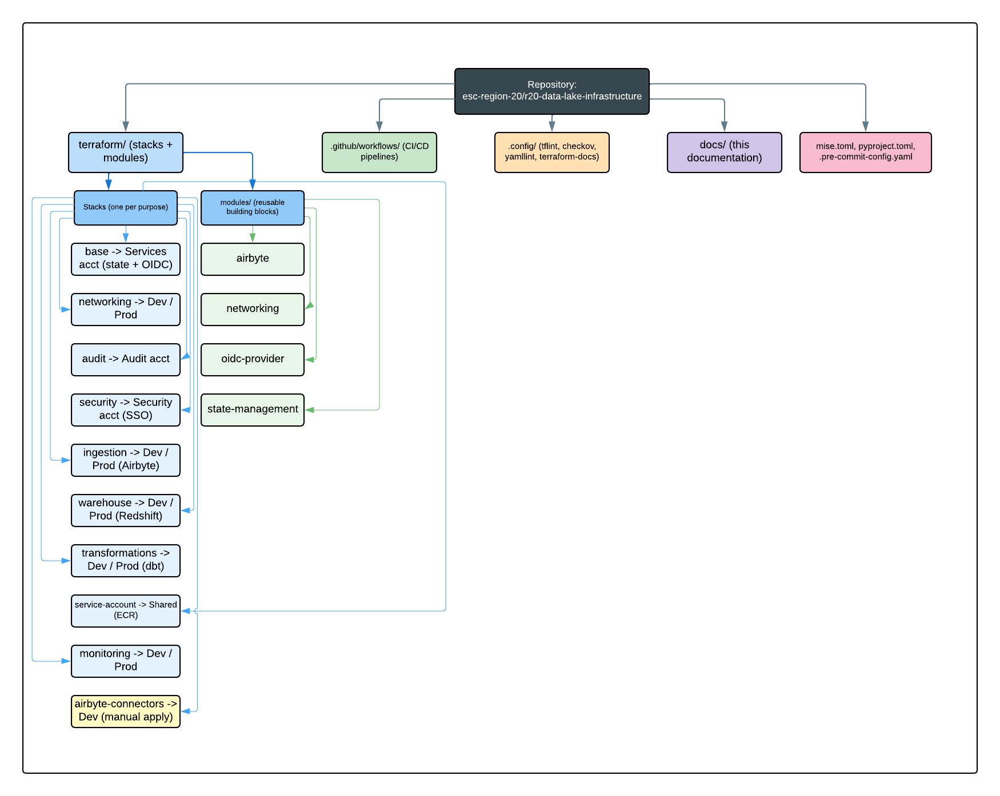

# KT-01 — Infrastructure Repository Overview

This is the starting point for engineers. By the end of this document you will understand how the repository is organized, what each tool does, how to set up your laptop, and the code conventions you must follow.

> **New to the terms used here?** Keep the [Key Concepts & Glossary](concepts-glossary.md) open in another tab. Every bolded concept below is defined there.

## 1. Guided walkthrough of the repository structure

Everything that builds the platform is **Infrastructure as Code (IaC)**: code files, mostly **Terraform**, that describe the AWS resources to create. There is no manual infrastructure deployments in the AWS console.



*Top-level layout: `terraform/` holds the stacks and reusable modules; `.github/workflows/` holds the CI automation; `.config/` holds the linter and scanner settings; `docs/` holds this documentation.*

### What is a "stack"?

> **What is a stack?** A **stack** is one directory under `terraform/` that Terraform manages as a single unit. Each stack has its own remote **state file**, its own deploy **workflow**, and a standard set of files: `main.tf` (the resources), `variables.tf` (the inputs it accepts), `providers.tf` (how it talks to AWS, including which account to deploy into), `terraform.tf` (Terraform/provider versions and the state backend), `outputs.tf` (values it exposes), and a `variables/` folder with one `<env>.tfvars` file per environment.

You almost always work inside **one** stack at a time. Knowing which stack owns a resource tells you exactly which directory to edit.

### The stacks under `terraform/`

Each stack targets an AWS account chosen by the `account_id` value in its environment's tfvars file. The account IDs are: shared services/CI `471624149663`, audit `627896767065`, dev `784590287037`, prod `029750300494`, and a separate delegated admin security account for identity.

| Stack | What it provisions (plain language) | Target account(s) | Environments (`variables/`) |
|---|---|---|---|
| `base` | Bootstrap stack. Creates the Terraform **state** backend (the `region-20-tf-state` S3 bucket + its KMS key) and the GitHub **OIDC** trust plus the central CI role `region-20-terraform-role`. | Services / CI `471624149663` | `default` |
| `networking` | The private network (**VPC** `172.17.0.0/16`, public and private subnets across three AZs, NAT gateway, VPC flow logs) and the Client VPN that lets the team reach private resources. | Dev `784590287037` (and prod) | `dev`, `prod` |
| `audit` | The centralized VPC flow-logs S3 bucket and its KMS key, kept in a separate audit account for tamper isolation. | Audit `627896767065` | `default` |
| `security` | IAM Identity Center resources: the Data-Lake workforce group, the `DataEngineer_Prod` and `DataEngineer_Dev` permission sets, and their account assignments. Runs from the security account as the Identity Center delegated administrator. | Security account | `security` |
| `service-account` | Shared-services resources used cross-account, principally the dbt container **ECR** repository (so one image build is pulled by both dev and prod) and its KMS key. | Services / CI `471624149663` | `shared` |
| `ingestion` | The data front door: self-hosted **Airbyte** (EC2 + RDS PostgreSQL), the S3 **raw / bronze / silver** buckets, **Glue** databases and crawlers, **Lake Formation** permissions, and a **Lambda** that syncs a Google Drive folder into the raw layer. | Dev `784590287037` (and prod) | `dev`, `prod` |
| `warehouse` | The serving layer: **Redshift Serverless** (the GOLD layer, private, KMS-encrypted), **Athena** workgroup, a bastion host for private access (not deployed), and supporting IAM/KMS. | Dev `784590287037` (and prod) | `dev`, `prod` |
| `transformations` | Runs **dbt** Core as an **ECS Fargate** task against the Redshift GOLD layer. Provisions the ECS cluster/task, task IAM roles, an artifacts S3 bucket, the dbt secret, CloudWatch logs, and a KMS key. | Dev `784590287037` (and prod) | `dev`, `prod` |
| `monitoring` | **CloudWatch** dashboards and alarms plus **SNS** notification topics covering Airbyte, Redshift, Athena, Glue, Lambda, dbt, and S3. | Dev `784590287037` (and prod) | `dev`, `prod` |
| `airbyte-connectors` | The Airbyte **sources, destinations, and connections** themselves, defined through the Airbyte Terraform provider. | Dev `784590287037` | `dev` |

> **Important — `airbyte-connectors` has no CI workflow.** Unlike every other stack, `airbyte-connectors` has **no** orchestrator workflow in `.github/workflows/`. It is applied **manually** by an operator. Treat changes to it with extra care: the automatic PR plan and reviewed-plan apply do **not** happen for this stack.

### The reusable modules under `terraform/modules/`

> **What is a module?** A **module** is a reusable building block of Terraform code that stacks *call*. A change inside a module ripples to every stack that uses it — see [KT-02 §2](kt-02-making-infrastructure-changes.md#2-modify-an-existing-module-or-stack).

| Module | What it builds | Called by |
|---|---|---|
| `state-management` | The S3 bucket + KMS key + IAM policy that hold Terraform remote state. | `base` |
| `oidc-provider` | The GitHub OIDC identity provider and the assumable central CI role. | `base` |
| `networking` | The VPC, subnets, route tables, NAT gateway, and flow-log wiring. | `networking` |
| `airbyte` | The self-hosted Airbyte deployment (EC2 Auto Scaling group, ALB, RDS config DB, security groups). | `ingestion` |

### The supporting top-level files and folders

| Path | Purpose |
|---|---|
| `.config/` | Configuration for the quality tools: `.tflint.hcl` (Terraform linting), `.checkov.yaml` (security scanning), `.terraform-docs.yaml` (auto-generated README tables), `.yamllint.yaml` (YAML linting). |
| `.github/workflows/` | All GitHub Actions automation: reusable workflows, per-stack orchestrators, and the `templates/terraform_stack.yml` starter for new stacks. |
| `docs/` | This documentation, including the KT series and the deeper reference docs. |
| `mise.toml` | Pins the exact versions of the local tools (Terraform, trufflehog, pre-commit, uv) and defines helper tasks. |
| `pyproject.toml` | The Python project/tooling definition (Python `>= 3.12`), managed by **uv**. The `nd_predictive_ordering` package is currently a stub. |
| `.pre-commit-config.yaml` | The list of **pre-commit hooks** that run when you commit (covered in [KT-02 §4](kt-02-making-infrastructure-changes.md#4-pre-commit-hooks-your-first-line-of-defense)). |

## 2. Toolchain overview

These tools run both on your laptop (via pre-commit) and in CI. **mise** installs the pinned versions so everyone matches.

| Tool | What it is | Why it is used here |
|---|---|---|
| **mise** | A tool-version manager that reads `mise.toml` and installs exact versions. | Guarantees every engineer and the CI use identical tool versions — no "works on my machine." |
| **Terraform** `1.14.3` | The IaC engine that creates AWS resources from `.tf` files. | The single mechanism for all infrastructure changes. |
| **tflint** | A Terraform linter driven by `.config/.tflint.hcl`. | Enforces naming and style rules (see §4 below). |
| **Checkov** | A security/compliance scanner for IaC, driven by `.config/.checkov.yaml`. | Catches risky settings (unencrypted storage, broad IAM) before they ship. |
| **pre-commit** | A framework that runs the hooks in `.pre-commit-config.yaml` on `git commit`. | Moves quality checks to your laptop so problems are caught early. |
| **uv** | A fast Python environment/package manager using `pyproject.toml`. | Manages the Python toolchain (ruff today, Lambda deps later). |
| **ruff** | A fast Python linter/formatter, run via `mise run lint`. | Keeps Python code clean. |
| **trufflehog** | A secret scanner, run via `mise run trufflehog-scan`. | Stops accidentally committed credentials from entering Git history. |

## 3. Local environment setup — step by step

Follow these once on a new machine. Run every command from the **repository root** unless told otherwise.

### Step 1 — Install mise

mise is the only thing you install by hand; it installs everything else. Follow the official instructions for your operating system at <https://mise.jdx.dev/getting-started.html>. On macOS this is typically:

```bash
brew install mise
```

After installing, add mise to your shell so it activates automatically (the installer prints the exact line; for zsh it is usually):

```bash
echo 'eval "$(mise activate zsh)"' >> ~/.zshrc
```

Then open a new terminal so the change takes effect.

### Step 2 — Trust this repo's tool config

mise will not run a project's `mise.toml` until you explicitly trust it. This is a one-time safety confirmation. From the repository root:

```bash
mise trust
```

You will see a confirmation that the config file is now trusted.

### Step 3 — Install the pinned tool versions

This reads `mise.toml` and downloads Terraform `1.14.3`, trufflehog, pre-commit, and uv:

```bash
mise install
```

This may take a minute the first time. When it finishes, the tools are available in your shell.

### Step 4 — Set up the Python environment and Git hooks

The repo defines a convenience task that does two things at once: it builds the Python environment and installs the pre-commit hooks into your local Git.

```bash
mise run setup
```

> **What this actually runs.** The `setup` task (defined in `mise.toml`) runs `uv sync` (creates the Python virtual environment from `pyproject.toml`) followed by `pre-commit install` (wires the hooks in `.pre-commit-config.yaml` into your `.git/hooks` so they run on commit). Because `default_install_hook_types` includes both `pre-commit` and `commit-msg`, this also enables the Conventional Commits message check.

### Step 5 — Verify the setup

Confirm the tool versions resolve and the hooks are wired:

```bash
terraform version       # should report 1.14.3
mise run lint           # runs ruff; should complete with no errors
pre-commit run --all-files   # runs every hook across the repo
```

**What you'll see:** `pre-commit run --all-files` prints each hook with a `Passed`, `Failed`, or `Skipped` status. On a clean checkout everything should pass or skip. If a hook reports `Failed`, read [KT-02 §4](kt-02-making-infrastructure-changes.md#4-pre-commit-hooks-your-first-line-of-defense) for how to handle each one.

### Common commands you will use often

These are the day-to-day commands (also listed in the repo's `CLAUDE.md`):

```bash
mise run setup                 # uv sync + pre-commit install (first-time setup)
mise run lint                  # ruff check via uv
mise run trufflehog-scan       # secret scan since HEAD
uvx ruff check . --fix         # auto-fix Python lint issues
pre-commit run --all-files     # run every hook manually
```

And from inside a single stack directory (for example `terraform/networking/`), the offline validation sequence that mirrors CI:

```bash
terraform fmt -check -recursive
terraform init -upgrade -input=false -lock=false -reconfigure -backend=false   # offline validation
terraform validate
tflint --config "$(git rev-parse --show-toplevel)/.config/.tflint.hcl" --recursive
checkov --config-file ./.config/.checkov.yaml -d .
```

> **Why the `-backend=false` flag?** It tells Terraform to skip connecting to the remote S3 state when you only want to *validate* the code locally. This lets you check syntax and structure without AWS credentials. Actual planning and applying happen in CI.

## 4. Naming conventions and Terraform code-style rules

These rules are enforced automatically by **tflint** (config: `.config/.tflint.hcl`). The pre-commit hook and CI will reject code that breaks them, so treat this as a checklist before you commit.

### Naming and style checklist

- [ ] **`snake_case` everywhere.** Variables, locals, outputs, resources, modules, and data sources must use lowercase-with-underscores names (for example `flow_log_bucket_arn`, not `flowLogBucketArn`).
- [ ] **Every stack and module declares `required_version`** in its `terraform.tf` block (for example `required_version = ">= 1.11.0"`).
- [ ] **Every stack and module declares `required_providers`** with a pinned version (for example `aws = { source = "hashicorp/aws", version = "~> 6.0" }`).
- [ ] **Every variable is typed.** No untyped `variable` blocks — always include a `type`.
- [ ] **Every variable has a `description`.** Undocumented variables are rejected.
- [ ] **Every output has a `description`.** Undocumented outputs are rejected.
- [ ] **Comments use `#`, not `//`.** The C-style `//` comment is disallowed.
- [ ] **Module sources are pinned and versioned.** Registry modules must specify a `version`; Git-sourced modules must pin to a ref. (Registry-style pinning; the repo-wide commit-hash requirement `CKV_TF_1` is intentionally skipped in Checkov.)
- [ ] **Standard module structure.** Modules follow the conventional file layout (`main.tf`, `variables.tf`, `outputs.tf`, `versions.tf`/`terraform.tf`).
- [ ] **No unused declarations.** Declared-but-never-used variables, locals, and data sources are flagged.
- [ ] **No deprecated syntax.** Old 0.11-style interpolation, legacy index syntax, and the 2-argument `lookup()` are disallowed.

### The `create` soft-delete convention

> **What is the `create` switch?** Most stacks in this repo expose a top-level boolean variable named `create` (defaulting to `true`). Every top-level resource and module call is gated on it (`count = var.create ? 1 : 0`). Setting `create = false` in a tfvars file and applying it **tears down everything the stack manages while keeping the code and the state file intact**. Flipping it back to `true` rebuilds.

You will see this pattern throughout (for example in `terraform/warehouse/redshift.tf`, `terraform/security/main.tf`, and `terraform/ingestion/main.tf`). It is the safe, reversible way to pause or decommission a stack without running `terraform destroy` or editing state by hand. Because of the `count`, outputs from these stacks use `try(module.x[0].output, null)` so they resolve cleanly even when the stack is disabled.

### The `Name` tag convention

Every resource carries a `Name` tag derived from the stack's `local.name` (for example `"${local.name}-warehouse"`). On top of that, each stack's `providers.tf` sets `default_tags` — `Environment`, `Team`, `ManagedBy = "Terraform"`, and `Stack` — that are applied to all resources automatically. Consistent tagging is what makes cross-stack lookups (via tag-filtered **data sources**) and cost allocation work, so always add a meaningful `Name` tag to any new resource.

## Related deep-dive documents

- [Key Concepts & Glossary](concepts-glossary.md) — definitions for every term used above
- [KT-02 — How to Make Infrastructure Changes](kt-02-making-infrastructure-changes.md) — your guide to making a safe first change
- [Deployment with artifacts](deployment_with_artifacts.md) — the reviewed-plan handoff and new-stack guide
- [OIDC role chain](oidc_role_chain.md) — how GitHub authenticates into AWS
- [Terraform checks workflow](terraform_checks.md) and [General checks workflow](general_checks.md) — the CI quality gates
- [Terraform pull-request workflow](terraform_pull_request.md) — the repo-wide PR gate
