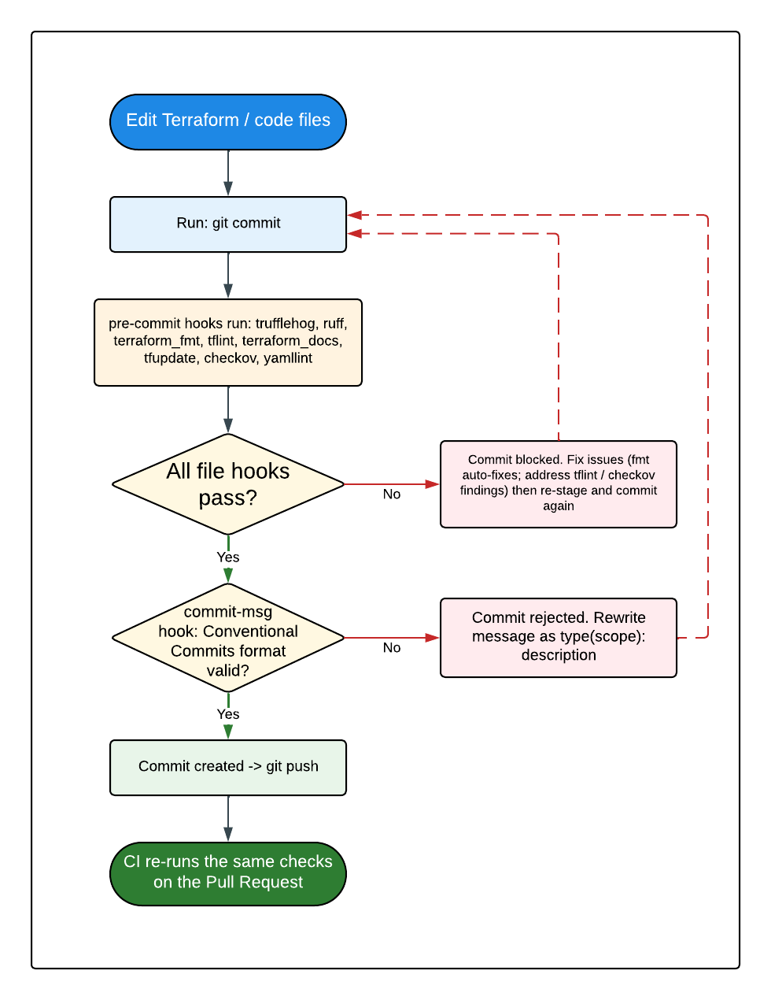

# KT-02 — How to Make Infrastructure Changes

This guide walks you through making safe changes to the Region 20 infrastructure: adding a new **stack**, editing an existing stack or **module**, adding a new environment, passing the local quality checks, and writing commit messages the tooling will accept.

> **Prerequisite:** Finish [KT-01 — Infrastructure Repository Overview](kt-01-infrastructure-overview.md) first, including the machine setup. Every bolded term is defined in the [Key Concepts & Glossary](concepts-glossary.md).

> **The golden rule.** You never change AWS by hand and you never push straight to `main`. You change **code**, open a **Pull Request (PR)**, let CI run a Terraform **plan** for review, and only after the PR is approved and merged does CI **apply** the reviewed plan. What happens *after* you push is detailed in [Deployment with artifacts](deployment_with_artifacts.md).

The general loop for any change is:

1. Create a branch.
2. Edit the Terraform code.
3. Format and validate locally.
4. Commit (the pre-commit hooks run automatically).
5. Push and open a PR.
6. Review the plan that CI posts on the PR.
7. Merge, which triggers the apply.

## 1. Add a new Terraform stack

Adding a stack means creating a new directory under `terraform/` and a matching orchestrator **workflow**. The repo provides a starter workflow at [.github/workflows/templates/terraform_stack.yml](../.github/workflows/templates/terraform_stack.yml).

> **Do not duplicate effort.** The authoritative, step-by-step procedure already lives in [Deployment with artifacts — "Creating a New Infrastructure Stack"](deployment_with_artifacts.md#creating-a-new-infrastructure-stack). Use that as your checklist. The steps below summarize it and add the beginner context.

### Step 1 — Create the stack directory and files

Create `terraform/<your-stack>/` with the standard files. Every stack needs all of these:

```
terraform/<your-stack>/
  main.tf          # the resources (or module calls) this stack manages
  variables.tf     # inputs, including account_id and create
  providers.tf     # AWS provider with the assume_role into the target account
  terraform.tf     # required_version, required_providers, and the S3 backend block
  outputs.tf       # values this stack exposes (or a comment if none)
  variables/
    dev.tfvars     # must set environment + account_id
    prod.tfvars    # must set environment + account_id
```

**`variables.tf` must include `account_id` and `create`.** `account_id` is how the stack knows which AWS account to deploy into; `create` is the soft-delete switch (see [KT-01 §4](kt-01-infrastructure-overview.md#the-create-soft-delete-convention)). Copy these exactly from an existing stack such as `terraform/ingestion/variables.tf`:

```hcl
variable "create" {
  description = "Whether this stack should provision its resources. Set to false to soft-delete everything the stack manages while preserving state and code."
  type        = bool
  default     = true
}

variable "account_id" {
  description = "AWS account ID of the target account; used to construct the cross-account assume_role ARN"
  type        = string
}
```

**`providers.tf` must chain-assume the per-account execution role.** This is the second hop of the authentication chain (see [OIDC role chain](oidc_role_chain.md)). Copy the pattern from an existing stack and change only the `Stack` tag:

```hcl
provider "aws" {
  region = var.aws_region

  assume_role {
    role_arn = "arn:aws:iam::${var.account_id}:role/region-20-terraform-execution-role"
  }

  default_tags {
    tags = {
      Environment = var.environment
      Team        = var.team
      ManagedBy   = "Terraform"
      Stack       = "your-stack"
    }
  }
}
```

**`terraform.tf` must set a UNIQUE backend `key`.** All stacks share the one state bucket `region-20-tf-state`, so the `key` is what keeps your stack's state separate. Use `<your-stack>/terraform.tfstate`:

```hcl
terraform {
  required_version = ">= 1.11.0"

  required_providers {
    aws = {
      source  = "hashicorp/aws"
      version = "~> 6.0"
    }
  }

  backend "s3" {
    bucket       = "region-20-tf-state"
    key          = "your-stack/terraform.tfstate"
    region       = "us-east-1"
    encrypt      = true
    use_lockfile = true
    kms_key_id   = "arn:aws:kms:us-east-1:471624149663:key/77d58064-e84b-4646-ae3d-180ec68f4625"
  }
}
```

> **Stop and double-check the backend `key`.** If two stacks share the same `key`, they will overwrite each other's state and corrupt both. The `key` must be unique to this stack.

### Step 2 — Create the orchestrator workflow

Copy the template and substitute your stack name everywhere `${STACK_NAME}` appears:

```bash
cp .github/workflows/templates/terraform_stack.yml .github/workflows/terraform_<your-stack>.yml
```

Then edit the new file and replace every `${STACK_NAME}` with your stack name (this updates the workflow `name`, the path triggers under `terraform/<your-stack>/**`, and `WORKING_DIR`). Match the structure of an existing orchestrator like `.github/workflows/terraform_networking.yml`.

### Step 3 — Confirm the GitHub variables exist (they already do)

Because every stack reuses the **same central CI role**, you do **not** need to add per-stack or per-environment GitHub variables. Just confirm the repo-level variables `AWS_ROLE_ARN` and `AWS_REGION` are set (they are). See the callout in [§3 below](#3-add-a-new-environment) about variables that the older docs mention but the repo does not use.

## 2. Modify an existing module or stack

This is the most common task. The loop is the same whether you edit a stack directly or a module it calls.

### Editing a stack

1. **Branch.** Never work on `main`:

   ```bash
   git checkout -b fix/<short-description>
   ```

2. **Edit** the relevant `.tf` file in the stack directory (for example add a resource in `terraform/monitoring/alarms_redshift.tf`).

3. **Format** the code to the canonical style:

   ```bash
   terraform fmt -recursive
   ```

4. **Validate** the syntax and structure offline (no AWS credentials needed):

   ```bash
   terraform -chdir=terraform/<your-stack> init -upgrade -input=false -lock=false -reconfigure -backend=false
   terraform -chdir=terraform/<your-stack> validate
   ```

   **What you'll see:** `Success! The configuration is valid.` If you instead see an error, read the message — it usually names the exact file and line.

5. **Commit and push** (the [pre-commit hooks](#4-pre-commit-hooks-your-first-line-of-defense) run automatically on commit), then open a PR. CI runs the full `plan` for each environment and posts it on the PR for review.

> **You do not run `terraform plan` or `apply` yourself.** The CI does it with the correct credentials and saves the reviewed plan as an **artifact**. Running an apply from your laptop would bypass the review gate.

### Editing a module (the ripple effect)

> **Why module edits need extra care.** A module in `terraform/modules/` is shared. When you change `terraform/modules/networking/main.tf`, that change affects **every stack that calls that module**, not just the one you were thinking about. In order for changes to be triggerd from CI when updating a module, we need to add a explicit trigger on the CI workflow file:

```
on:
  pull_request:
    branches:
      - main
    paths:
      - 'terraform/networking/**
      - 'terraform/modules/ingestion/**'
      - '.github/workflows/terraform_networking.yml'
  push:
    branches:
      - main
    paths:
      - 'terraform/networking/**'
      - 'terraform/modules/networking/**'
      - '.github/workflows/terraform_networking.yml'
```

Before editing a module:

1. **Find who calls it.** Search the repo for the module source path:

   ```bash
   grep -rl "modules/networking" terraform --include="*.tf"
   ```

   Every stack that appears in the results will be affected by your change.

2. **Edit the module**, then format and validate as above.

3. **Review the plan for every calling stack.** When you open the PR, CI plans each affected stack. Read **all** of those plans, not just the one you care about, to confirm your module change does not unintentionally alter another stack.

## 3. Add a new environment

Adding an environment (for example `qa`) is mostly about creating one tfvars file — the CI discovers it automatically. But there is an AWS prerequisite that must be done first.

### Step 1 — Create the execution role in the target AWS account

> **Stop — this AWS step must be done before any CI run will work.** In the new account, an IAM role named **`region-20-terraform-execution-role`** must exist, and its trust policy must allow `sts:AssumeRole` from the **central CI role** (`vars.AWS_ROLE_ARN`, which is `region-20-terraform-role` in the services account `471624149663`). Without it, every plan/apply for the new environment fails with `AccessDenied` on the chained assume-role. The exact trust policy is documented in [OIDC role chain — Onboarding a New Account](oidc_role_chain.md#onboarding-a-new-account).

### Step 2 — Add the tfvars file

Copy an existing environment's file and edit the two key fields:

```bash
cp terraform/<your-stack>/variables/dev.tfvars terraform/<your-stack>/variables/qa.tfvars
```

Then edit `qa.tfvars` so it sets at least:

```hcl
environment = "qa"
account_id  = "<the-new-account-id>"
# ...plus any environment-specific values
```

> **Document every variable in every environment's tfvars.** Production and any new environment's tfvars should carry the same per-variable inline comments as `dev.tfvars`, not a stripped-down version. The next operator relies on those comments.

### Step 3 — Nothing else is needed

The orchestrator workflow builds its environment **matrix** by listing the files in `variables/` at run time. Your new `qa.tfvars` is picked up automatically, a `qa` plan appears on the next PR, and a `qa` apply runs on merge. No workflow YAML edit is required.

> **Discrepancy to be aware of — no per-environment GitHub variables.** The Jira ticket and the project `CLAUDE.md` mention variables like `AWS_ROLE_ARN_<env>`, `STATE_BUCKET_<env>`, and `STATE_KMS_KEY_ID_<env>`. **These do not exist in this repository.** They describe an older design. The repo uses a single central role (`AWS_ROLE_ARN`) for every environment, a hardcoded state backend in each `terraform.tf`, and selects the target account purely through `account_id` in the tfvars. There is nothing per-environment to configure on the GitHub side.

## 4. Pre-commit hooks — your first line of defense

When you run `git commit`, a set of **pre-commit hooks** runs automatically. If any hook fails, the commit is blocked until you fix the problem. This catches issues on your laptop instead of in CI.



*Local flow: editing code, then `git commit` triggers the hooks (formatting, linting, docs, security, commit-message) before the commit is accepted and you push to open a PR.*

The hooks are configured in `.pre-commit-config.yaml`. Here is what each does and how to recover when it fails.

| Hook | What it checks | When it fails, do this |
|---|---|---|
| **trufflehog** | Scans for secrets (keys, passwords) committed since `HEAD`. | Remove the secret from the code. Use AWS Secrets Manager or SSM instead. Never commit credentials, even temporarily. |
| **ruff** | Python lint/format on changed `.py` files. | Run `uvx ruff check . --fix` to auto-fix, then re-stage and commit. |
| **conventional-pre-commit** | Validates the **commit message** format (runs at the `commit-msg` stage). | Rewrite your message in `type(scope): description` form — see [§5 below](#5-conventional-commits). |
| **terraform_fmt** | Canonical Terraform formatting. | This hook **auto-fixes** the files. Just `git add` the changed files and commit again. |
| **terraform_tflint** | Naming and style rules from `.config/.tflint.hcl`. | Read the error (it names the rule and location). Fix the name/type/description, then commit again. The rules are listed in [KT-01 §4](kt-01-infrastructure-overview.md#naming-and-style-checklist). |
| **terraform_docs** | Regenerates the input/output tables between the `BEGIN_TF_DOCS`/`END_TF_DOCS` markers in each `README.md`. | The hook re-writes the README and re-stages it. Just commit again. Never hand-edit between those markers. |
| **tfupdate** | Locks provider versions for linux/darwin (amd64 + arm64). | If it updates the lockfile, re-stage the lockfile and commit again. |
| **checkov** | Security/compliance scan using `.config/.checkov.yaml`. | See the dedicated guidance below. |
| **yamllint** | YAML style on workflow and config files (`.config/.yamllint.yaml`, strict). | Fix the reported indentation/line-length/spacing issue. Note: line length over 150 chars is a warning, not an error. |

### Handling a Checkov finding

Checkov flags risky-looking IaC settings. For each finding, you have two legitimate choices:

1. **Fix it** — change the resource configuration to satisfy the control (for example, add encryption). This is the default; prefer fixing over skipping.

2. **Skip it with a written justification** — only when the control genuinely does not apply. There are two scopes:

   - **One resource only:** add an inline skip *inside* the resource block, with a reason:

     ```hcl
     resource "aws_lambda_function" "example" {
       #checkov:skip=CKV_AWS_117: Lambda calls AWS service APIs on public endpoints; no VPC required
       # ...
     }
     ```

   - **Repo-wide (the same control everywhere):** add the check ID to the `skip-check` list in `.config/.checkov.yaml` with a comment explaining why. Several are already there (for example `CKV_AWS_145` — the project uses SSE-S3 instead of KMS for S3 for now).

> **Never skip a check without a written reason.** The skip comment is the audit trail. A reviewer must be able to read it and understand why the control was waived.

### Running the hooks manually

The hooks run on `git commit`, but you can run them at any time across the whole repo:

```bash
pre-commit run --all-files
```

This is the fastest way to surface every issue before you even commit.

## 5. Conventional Commits

Every commit message must follow the **Conventional Commits** standard. This is enforced by the `conventional-pre-commit` hook at the `commit-msg` stage, a non-conforming message is **rejected** and the commit does not happen.

### The format

```
type(scope): description
```

- **type** — what kind of change it is (required).
- **scope** — the area affected, usually the stack or module name (optional but encouraged, in parentheses).
- **description** — a short, lowercase, imperative summary (required).

### Allowed types

| Type | Use for |
|---|---|
| `feat` | A new feature or capability |
| `fix` | A bug fix |
| `docs` | Documentation-only changes |
| `chore` | Tooling, dependencies, or housekeeping that is not a feature or fix |
| `refactor` | Code restructuring with no behavior change |
| `test` | Adding or changing tests |
| `ci` | Changes to CI/workflow files |
| `build` | Build-system or packaging changes |
| `perf` | Performance improvements |
| `style` | Formatting-only changes |

### Real examples

```bash
git commit -m "feat(monitoring): add composite alarm for Redshift connection failures"
git commit -m "fix(networking): correct private subnet CIDR overlap in dev"
git commit -m "docs(kt): add infrastructure overview and change guide"
git commit -m "chore(deps): bump checkov hook to 3.2.344"
```

### What a rejected commit looks like, and how to fix it

If you write a message that does not start with a valid type, the commit is blocked:

```bash
$ git commit -m "updated the alarms"
[INFO] Initializing environment for ...
Conventional Commit  ...........................................Failed
- hook id: conventional-pre-commit
- exit code: 1

Bad commit message: "updated the alarms"
Expected: type(scope): description
```

**The fix** is simply to re-run the commit with a conforming message:

```bash
git commit -m "fix(monitoring): correct alarm threshold for redshift"
```

Your code changes were never lost, only the commit message was rejected. Restate it correctly and commit again.

## What happens after you push

Once your PR is open, CI takes over: it runs the quality checks, generates the reviewable Terraform **plan** per environment, and — after merge — applies the exact reviewed plan. That full pipeline (the plan-to-apply handoff, the reviewed-plan **artifact**, and the apply on merge) is documented in [Deployment with artifacts](deployment_with_artifacts.md).

## Related deep-dive documents

- [Key Concepts & Glossary](concepts-glossary.md) — definitions for every term used above
- [KT-01 — Infrastructure Repository Overview](kt-01-infrastructure-overview.md) — repo tour, toolchain, machine setup, conventions
- [Deployment with artifacts](deployment_with_artifacts.md) — what happens after you push: the reviewed-plan handoff and new-stack guide
- [OIDC role chain](oidc_role_chain.md) — the GitHub-to-AWS authentication chain and account onboarding
- [Terraform checks workflow](terraform_checks.md) and [General checks workflow](general_checks.md) — the CI quality gates
- [Terraform pull-request workflow](terraform_pull_request.md) — the repo-wide PR gate
