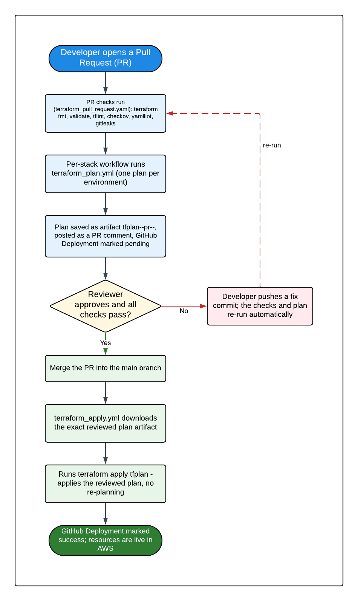

# KT-03: Deployment Guide (CI/CD Pipeline)

This guide explains, in plain language, how infrastructure changes get from a pull request into a live AWS account in the Region 20 data lake repository. It is written for engineers who are **new to AWS, Terraform, and GitHub Actions**, so every concept is defined the first time it appears.

> **What is CI/CD?**
> CI/CD stands for "Continuous Integration / Continuous Delivery." It is an automated pipeline that takes the code you write, checks it, and deploys it for you, so that humans do not run risky commands by hand. In this repository the pipeline is built from **GitHub Actions** workflows (automation scripts that GitHub runs for you on every pull request and merge).

> **What is Terraform?**
> Terraform is an **Infrastructure as Code (IaC)** tool. Instead of clicking around the AWS web console to create servers, networks, and databases, you describe what you want in text files (ending in `.tf`), and Terraform creates or changes the real AWS resources to match. "Infrastructure as Code" simply means your infrastructure is defined in version-controlled files, just like application code.

If a term is unfamiliar, check the [concepts glossary](concepts-glossary.md).

## 1. The big picture: plan, review, merge, apply

The single most important idea in this repository is the **reviewed-plan handoff**. Nothing is ever applied to AWS that a human has not first seen and approved.

Here is the flow in four sentences:

1. When you open a **pull request (PR)** (a proposed change to the code), the pipeline runs `terraform plan`, which produces a **preview** of exactly what would change in AWS. Nothing is changed yet.
2. That preview is saved as a downloadable file (an **artifact**) and also posted as a comment on your PR so reviewers can read it.
3. A reviewer approves and **merges** the PR into the `main` branch.
4. The merge triggers `terraform apply`, which downloads **that exact same reviewed preview** and applies it to AWS. The plan is never regenerated, so there are no surprises between what was reviewed and what is deployed.



*The plan/apply artifact handoff: a pull request generates a Terraform plan and saves it as an artifact, after review and merge to `main`, the apply job downloads that exact reviewed plan and applies it without re-planning.*

> **What is a Terraform plan?**
> A "plan" is Terraform's dry run. It compares what you wrote in code against what currently exists in AWS and prints a list of every resource it would add, change, or remove. It does **not** touch AWS, it only reports. The plan is saved to a file so it can be applied later, byte-for-byte unchanged.

> **What is an artifact?**
> In GitHub Actions, an "artifact" is a file (or bundle of files) that one workflow run saves so a later step or workflow can download it. Here, the saved plan is the artifact that the apply job reuses.

### Why this design matters

- **No surprises.** The apply step replays the reviewed plan instead of computing a fresh one. If the live AWS state drifted after review, a fresh plan could differ from what was approved. Replaying the saved plan removes that risk.
- **Auditability.** Every applied change traces back to a specific PR, a specific reviewer, and a specific saved plan file.
- **Least privilege at apply time.** The apply step never needs to decide *what* to do, it only executes a pre-approved decision.

The deeper end-to-end walkthrough of this handoff lives in [deployment_with_artifacts.md](deployment_with_artifacts.md).

## 2. How authentication works (no passwords, no long-lived keys)

Before the pipeline can change anything in AWS, it has to prove who it is. This repository uses **OIDC** so that **no long-lived AWS access keys are stored anywhere** in GitHub.

> **What is OIDC?**
> OIDC stands for "OpenID Connect." It is a standard way for one system to prove its identity to another using a short-lived, signed token instead of a permanent password. GitHub Actions can generate such a token for each workflow run, and AWS is configured to trust it. The token expires in minutes, so even if it leaked it would quickly be useless.

> **What is IAM?**
> IAM stands for "Identity and Access Management." It is the AWS service that controls *who* can do *what*. An IAM **role** is a set of permissions that a trusted identity can temporarily "assume" (borrow) to perform actions.

### The hub-and-spoke role chain

Authentication happens in three hops:

1. **GitHub gets a short-lived token.** When a workflow runs, GitHub Actions issues a signed OIDC token describing the repository and context.
2. **The token is exchanged for the central CI role.** The `aws-actions/configure-aws-credentials` step trades that token for temporary credentials on the **central CI role** named `region-20-terraform-role`. This role lives in the **Services account `471624149663`** and is the single entry point for *every* environment. Its GitHub Actions Variable is `AWS_ROLE_ARN`.
3. **Terraform chain-assumes the per-account execution role.** Each stack's `providers.tf` contains an `assume_role` block targeting `region-20-terraform-execution-role` in the **target** account. Which account is chosen depends entirely on the `account_id` value in that environment's tfvars file.


*The hub-and-spoke OIDC role chain: GitHub exchanges a short-lived token for the central `region-20-terraform-role` in the Services account, then Terraform chain-assumes `region-20-terraform-execution-role` in whichever target account `account_id` selects.*

> **What is "chain-assume"?**
> Assuming a role means temporarily borrowing its permissions. "Chain-assuming" means one role uses its credentials to assume a second role. Here the central CI role assumes the per-account execution role, so the actual AWS changes are made with the *target account's* execution-role permissions, not the central role's.

### The account map

| Account | AWS Account ID | Role in this repository |
|---------|---------------|--------------------------|
| Services / CI | `471624149663` | Hosts the central CI role (`region-20-terraform-role`) and the Terraform state bucket. |
| Audit | `627896767065` | Target account for the `audit` stack. |
| Dev | `784590287037` | Target account for the `dev` environment. |
| Prod | `029750300494` | Target account for the `prod` environment. |

The central CI role trusts **two** GitHub repositories: the live one `esc-region-20/r20-data-lake-infrastructure` and the legacy `caylent/region-20-infrastructure`. The live repository is the one you will use.

For the full role-chain reference, trust policies, and account onboarding, read [oidc_role_chain.md](oidc_role_chain.md).

## 3. How to read and interpret the plan artifact

Every PR produces a plan artifact. Learning to read it is the core skill for reviewing infrastructure changes safely.

### Where to find and download the artifact in GitHub

1. Open your pull request on GitHub.
2. Click the **Checks** tab (or scroll to the checks at the bottom of the PR).
3. Find the workflow named after your stack, for example **"Terraform - Region 20 base infrastructure"**, and click **Details** to open the workflow run.
4. On the run summary page, scroll to the **Artifacts** section at the bottom.
5. Click the artifact name to download it as a `.zip`.

The artifact name follows a strict pattern so it can be matched again at apply time:

```
tfplan-<stack>-pr-<number>-<env>
```

For example, a plan for the `base` stack on PR #142 targeting the `default` environment is named `tfplan-base-pr-142-default`. Each environment of a stack gets its **own** artifact (for example a `dev` and a `prod` artifact from the same PR).

### What is inside the artifact

| File | Format | What it is for |
|------|--------|----------------|
| `tfplan` | Binary (not human-readable) | The actual saved plan. This is the file the apply job replays byte-for-byte. Do not edit it. |
| `tfplan.txt` | Plain text (human-readable) | The readable version of the plan. This is what you review. It is also posted directly in the PR comment. |
| `tfplan.json` | JSON (machine-readable) | The same plan in JSON. Used by the Checkov security scanner and by any tooling that needs to parse the plan. |
| `deployment_id.txt` | Plain text | The GitHub Deployment ID for this plan (see [section 4](#4-github-deployments-pending-then-success-or-failure)). It lets the apply job update the correct deployment record. |

### How to read `tfplan.txt`

Terraform prefixes every line with a symbol that tells you the kind of change. Memorize these four:

| Symbol | Meaning | What to watch for |
|--------|---------|-------------------|
| `+ create` | A new resource will be created. | Usually safe. Confirm it is the resource you intended. |
| `~ update` | An existing resource will be changed **in place** (no downtime). | Read which attributes change. |
| `- destroy` | An existing resource will be **deleted**. | Highest-risk line. Make sure deletion is intended. Destroying a database or bucket can lose data. |
| `-/+ replace` | A resource will be **destroyed and recreated** (it cannot be changed in place). | Treat like a destroy. There may be downtime, and recreation gives the resource a new identity. |

> **Watch the summary line.** At the very end of `tfplan.txt` Terraform prints a count, for example:
> `Plan: 3 to add, 1 to change, 0 to destroy.`
> This one-line summary is your fastest sanity check. If you expected only an additive change but see `2 to destroy`, stop and investigate before approving.

A "No changes" plan (`Your infrastructure matches the configuration.`) means the code and live AWS state already agree, nothing will happen on apply.

## 4. GitHub Deployments: pending, then success or failure

Alongside the plan artifact, the pipeline creates a **GitHub Deployment** record so you can see the lifecycle of a change at a glance.

> **What is a GitHub Deployment?**
> It is a built-in GitHub object that tracks "this commit is being deployed to this environment" and shows a status badge. This repository drives it manually so the status reflects the real plan/apply lifecycle rather than auto-completing.

The status moves through these states:

| Status | When it is set | Meaning |
|--------|----------------|---------|
| `in_progress` | While `terraform plan` is running on the PR. | The preview is being generated. |
| `pending` | After a **successful** plan on the PR. | The plan is reviewed-and-waiting. It will be applied when the PR is merged. |
| `failure` | If the plan itself fails. | The plan could not be produced. Fix the code and push again. |
| `in_progress` | While `terraform apply` runs after merge. | The reviewed plan is being applied. |
| `success` / `failure` | After apply completes. | The change is live, or the apply failed. |

**Where to see it:** on the repository's main page, open the **Environments** section in the right-hand sidebar (or the **Deployments** view). Each environment (for example `dev`, `prod`, `default`) lists its recent deployments and their current status.

## 5. How to trigger a re-plan on an open PR

If you need a fresh plan on a PR that is already open (for example you fixed something a reviewer flagged), the workflows are triggered by `pull_request` events on branches targeting `main`, scoped to paths under each stack. That means a re-plan happens automatically whenever the PR's branch changes. In practice:

1. **Push a new commit to the PR branch (recommended).** Any commit that touches files under the stack's path (for example `terraform/base/**`) re-triggers the stack's orchestrator workflow, which regenerates the plan and updates the existing PR comment in place. This is the normal way to refresh a plan.
2. **Re-run the workflow from the Actions UI.** Open the failed or stale workflow run, and click **Re-run jobs** (or **Re-run failed jobs**). Use this when the code is correct but a transient error (for example a network blip) caused the run to fail. Re-running does **not** require a new commit.
3. **Close and reopen the PR.** Reopening a PR re-emits a `pull_request` event and re-triggers the workflow. Use this only if the other two options do not fire, for example if the run history is confusing.

> **Note on path filters.** Each stack's workflow only runs when files under that stack's directory change (for example the `base` workflow watches `terraform/base/**`). A commit that changes only an unrelated stack will not re-plan `base`. If you expected a plan and none ran, confirm your changed files are under the stack's path.

## 6. The GitHub repository variables you actually need

The pipeline reads a small set of **repository variables** (named values stored in GitHub, not in the code).

> **Where to set these:** in GitHub, go to **Settings -> Secrets and variables -> Actions -> Variables** at the repository level. These are non-secret **Variables**, not **Secrets**.

| Variable | Required? | What it holds | Example |
|----------|-----------|---------------|---------|
| `AWS_ROLE_ARN` | Required | The ARN of the single central CI role. The same value is used for every environment. | `arn:aws:iam::471624149663:role/region-20-terraform-role` |
| `AWS_REGION` | Recommended | The default AWS region. Workflows fall back to `us-east-1` if unset. | `us-east-1` |
| `TERRAFORM_VERSION` | Optional | Overrides the Terraform version. Workflows default to `1.11.3` if unset. | `1.11.3` |
| `NETWORK_AWS_REGION` | Optional | Region override used by the networking stack only. | `us-east-2` |

## 7. End-to-end walkthrough: open a PR, see a plan, merge, confirm apply

This is the full happy path a new engineer should be able to follow.

1. **Create a branch and make your change.** Edit the Terraform files for the stack you are changing (for example `terraform/base/`).
2. **Open a pull request against `main`.** GitHub starts the stack's orchestrator workflow.
3. **Wait for the plan.** Within a few minutes the workflow posts a PR comment titled **"Terraform Plan Results"** for each environment, with the readable plan inside a collapsible **"Show Terraform Plan"** section. The matching artifact `tfplan-<stack>-pr-<number>-<env>` appears on the workflow run.
4. **Read the plan.** Expand the comment and check the `+ / ~ / - / -/+` lines and the final `Plan:` summary (see [section 3](#3-how-to-read-and-interpret-the-plan-artifact)). Confirm the change matches your intent.
5. **Get a review.** Reviewers read the same plan. Changes to any `prod.tfvars` additionally require approval from the prod owners (see [the operations runbook](kt-04-operations-runbook.md) for CODEOWNERS).
6. **Merge to `main`.** Once approved and all checks pass, merge the PR.
7. **Watch the apply.** The push to `main` triggers the apply job. It looks up your merged PR, downloads the **exact** `tfplan` artifact from the PR, and runs `terraform apply tfplan`.
8. **Confirm success.** Open the apply workflow run and read the **Apply Summary** (it shows "Applied pre-generated plan from PR #N"). The GitHub Deployment for that environment flips to `success`. Your infrastructure is now live.

> **If the apply cannot find the plan artifact**, the job fails on purpose, an apply is never allowed without a reviewed plan. See the [troubleshooting guide](kt-05-troubleshooting-guide.md) for the fix.

## Related deep-dive documents

- [deployment_with_artifacts.md](deployment_with_artifacts.md) — the full plan-artifact handoff walkthrough, multi-environment matrix details, and new-stack creation guide.
- [oidc_role_chain.md](oidc_role_chain.md) — the complete OIDC authentication model, trust policies, and account onboarding steps.
- [terraform_pull_request.md](terraform_pull_request.md) — the PR validation checks (format, validate, tflint, checkov) that gate every PR.
- [terraform_checks.md](terraform_checks.md) — details of the credential-free Terraform checks workflow.
- [general_checks.md](general_checks.md) — YAML lint and secret-scan checks that run repository-wide.
- [KT-04: Operations Runbook](kt-04-operations-runbook.md) — bootstrap, destroy, workspaces, state recovery, and production approvals.
- [KT-05: Troubleshooting Guide](kt-05-troubleshooting-guide.md) — how to resolve the common CI/CD, OIDC, and check failures.
- [concepts-glossary.md](concepts-glossary.md) — plain-language definitions of every term used here.
