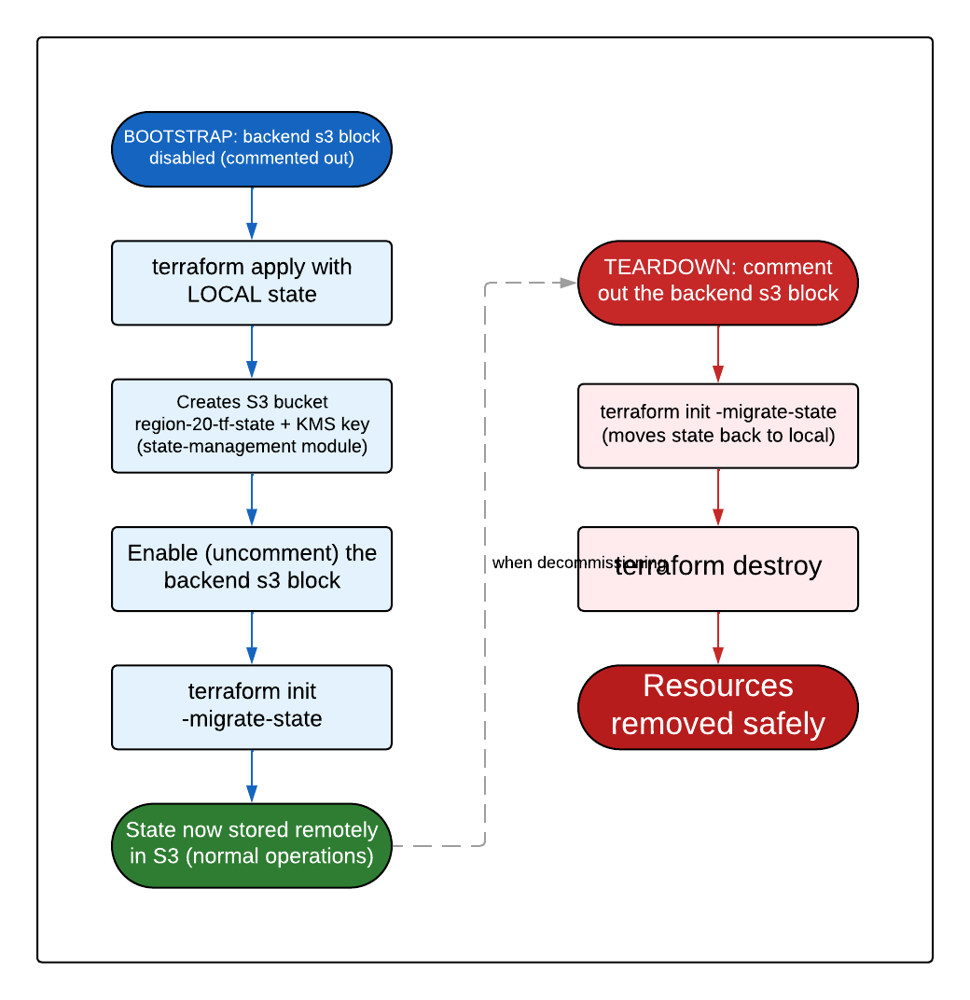

# KT-04: Operations Runbook

This runbook contains the step-by-step operational procedures for running the Region 20 data lake infrastructure. It is written for engineers who are **new to AWS, Terraform, and GitHub Actions**, so every concept is defined the first time it appears, and every procedure is a numbered, copy-pasteable sequence.

> **What is Terraform?**
> Terraform is an **Infrastructure as Code (IaC)** tool. You describe AWS resources (networks, buckets, roles) in text files ending in `.tf`, and Terraform creates or changes the real AWS resources to match. "Infrastructure as Code" means your infrastructure lives in version-controlled files.

> **What is a "stack"?**
> In this repository a "stack" is a self-contained Terraform configuration in its own directory under `terraform/` (for example `terraform/base/`, `terraform/networking/`). Each stack manages one logical area of infrastructure and has its own state.

> **What is "state"?**
> Terraform keeps a record of every resource it manages in a file called the **state file** (`terraform.tfstate`). This file maps your code to the real AWS resource IDs. It is the source of truth Terraform consults before every plan and apply. In this repository state lives in an S3 bucket, not on your laptop (except briefly during bootstrap).

All terms are defined in the [concepts glossary](concepts-glossary.md).

> **Behavioral note for operators.** Day-to-day infrastructure changes go through the CI/CD pipeline described in [KT-03](kt-03-deployment-guide.md) (open a PR, get a plan, merge, apply). The procedures in this runbook are **operational** tasks (bootstrapping, destroying, unlocking) that are run deliberately and carefully, usually outside the normal PR flow. Read the whole procedure before running any command.

## 1. Bootstrap the `base` stack from scratch (local state -> S3)

The `base` stack is special: it is the **first** stack that must exist, because it *creates the very thing every other stack depends on*. The S3 bucket and KMS encryption key that hold all Terraform state.

> **What is the chicken-and-egg problem here?**
> Every stack stores its state in an S3 bucket. But the `base` stack's job is to *create* that bucket. The `base` stack cannot store its own state in a bucket that does not exist yet. The solution is a two-phase "bootstrap dance": first run Terraform with state on your **local disk** to create the bucket, then move (migrate) that state **into** the bucket once it exists.



*The base stack bootstrap lifecycle: apply locally to create the state S3 bucket and KMS key, then enable the S3 backend and migrate state into the bucket. The reverse is performed before destroying.*

### Understand the current state of the files first

Before you run anything, understand what is in the repository **today**:

- `terraform/base/terraform.tf` **already contains an active `backend "s3"` block** pointing at the bucket `region-20-tf-state` in the Services account. This means `base` is **already on remote state** in the running environment. You only perform a full from-scratch bootstrap when standing up a brand-new environment where that bucket does not yet exist.
- `state.tf` also calls the `modules/state-management` module, which is what actually **creates** the `region-20-tf-state` bucket and its KMS key.

> **What is KMS?**
> KMS stands for "Key Management Service." It is the AWS service that creates and controls encryption keys. The state bucket is encrypted with a KMS key so the state file (which can contain sensitive values) is never stored in plain text.

### The from-scratch bootstrap procedure

Use this only when creating the state bucket for the first time in a fresh Services account.

- [ ] **Step 1 — Disable the remote backend so Terraform uses local state.** Temporarily comment out the `backend "s3"` block in `terraform/base/terraform.tf`. With no backend configured, Terraform writes state to a local `terraform.tfstate` file on your disk. This is required because the bucket does not exist yet.

- [ ] **Step 2 — Initialize with local state.** From inside `terraform/base/`, run:
  ```bash
  terraform init
  ```
  You should see `Terraform has been successfully initialized!` and Terraform will report it is using local state.

- [ ] **Step 3 — Select or create the workspace.** Workspaces isolate one environment from another (see [section 3](#3-workspace-management)). For `base`, the environment is `default`:
  ```bash
  terraform workspace new default 2>/dev/null || terraform workspace select default
  ```

- [ ] **Step 4 — Apply locally to create the bucket and key.** This runs the `modules/state-management` module, which creates the `region-20-tf-state` S3 bucket and the KMS key:
  ```bash
  terraform apply -var-file=variables/default.tfvars
  ```
  Review the plan, confirm it creates the S3 bucket and KMS key, and type `yes`. When it finishes, the bucket and key exist in AWS, but the state describing them is still on your local disk.

- [ ] **Step 5 — Re-enable the remote backend.** Un-comment the `backend "s3"` block in `terraform/base/terraform.tf` so it again points at `region-20-tf-state`.

> **Stop point.** Confirm Step 4 completed successfully and the `region-20-tf-state` bucket actually exists in the AWS console **before** proceeding. If the bucket does not exist, the next step will fail.

- [ ] **Step 6 — Migrate the local state into the bucket.** Run:
  ```bash
  terraform init -migrate-state
  ```
  Terraform detects that the backend changed (from local to S3) and asks to copy the existing local state into the new S3 backend. Type `yes`. Your state now lives in `region-20-tf-state` under the key `base/terraform.tfstate`.

- [ ] **Step 7 — Verify.** Run a plan:
  ```bash
  terraform plan -var-file=variables/default.tfvars
  ```
  You should see **"No changes. Your infrastructure matches the configuration."** That confirms the migrated state correctly reflects the resources you just created.

From this point on, `base` (and every other stack, which already has an active S3 backend) operates entirely through the CI/CD pipeline described in [KT-03](kt-03-deployment-guide.md).

The deeper backend/bootstrap discussion also appears in [deployment_with_artifacts.md](deployment_with_artifacts.md).

## 2. Safely destroy (or disable) a stack

There are **two** ways to remove what a stack manages. Choose based on whether you might want it back.

### Option A (preferred): soft-delete with `create = false`

Most stacks in this repository (for example `ingestion`, `networking`, `audit`, `warehouse`, `security`, `monitoring`, `transformations`, `service-account`) expose a top-level boolean variable called `create`:

```hcl
variable "create" {
  description = "Whether this stack should provision its resources. Set to false to soft-delete everything the stack manages while preserving state and code."
  type        = bool
  default     = true
}
```

Every top-level resource and module call in the stack is gated on `count = var.create ? 1 : 0`. This means you can tear down everything the stack manages **through the normal PR flow**, without any destroy command or state surgery:

- [ ] In the stack's tfvars file (for example `terraform/ingestion/variables/dev.tfvars`), set:
  ```hcl
  create = false
  ```
- [ ] Open a PR. The plan will show every resource as `- destroy`.
- [ ] Review carefully (this is a full teardown), then merge. The apply destroys the resources.
- [ ] The stack's **code and state file remain intact**. To bring everything back later, flip `create = true` in the same tfvars file and merge again.

> **Why prefer soft-delete?** It stays inside the reviewed-plan CI/CD flow, leaves no orphaned code, preserves the workspace and state, and is reversible with a one-line change. Use it for pausing a stack, decommissioning a dev environment overnight to save cost, or any teardown you might reverse.

> **`base` is the exception.** The `base` stack does **not** carry a `create` flag, because disabling it would delete the very state bucket all other stacks depend on. Never soft-delete `base`. To fully remove `base`, follow Option B below.

### Option B: hard-destroy with backend migration (reverse of bootstrap)

A `terraform destroy` is only needed when permanently removing a stack that has no `create` flag (notably `base`), or when fully decommissioning an environment. For a state-bucket-owning stack like `base`, you must reverse the bootstrap so Terraform can delete the bucket without trying to write state into a bucket it is deleting.

- [ ] **Step 1 — Move state back to local.** In `terraform/base/terraform.tf`, comment out the `backend "s3"` block. Then run, from `terraform/base/`:
  ```bash
  terraform init -migrate-state
  ```
  Type `yes` to copy state from S3 back to a local file. This is the exact reverse of bootstrap Step 6, and it is exactly what the comment at the top of `terraform/base/state.tf` instructs.

- [ ] **Step 2 — Select the workspace.**
  ```bash
  terraform workspace select default
  ```

- [ ] **Step 3 — Destroy.**
  ```bash
  terraform destroy -var-file=variables/default.tfvars
  ```
  Review the destruction plan, then type `yes`.

> **Irreversible action.** `terraform destroy` permanently deletes AWS resources. For `base`, that includes the state bucket. Make absolutely sure no other stack still depends on it, and that you have any required backups, before confirming.

> **For ordinary stacks, do not reach for `terraform destroy`.** Use Option A (`create = false`) instead — it is reversible and stays in the audited PR flow.

## 3. Workspace management

> **What is a workspace?**
> A Terraform "workspace" is a named, isolated copy of state that lives inside the **same** backend bucket. This repository uses **one workspace per environment** (for example `dev`, `prod`, `default`). All workspaces for a stack share the one state bucket (`region-20-tf-state`) but keep separate state, so changes to `dev` never touch `prod`.

### The everyday commands

Run these from inside a stack directory (for example `terraform/networking/`):

```bash
# List all workspaces; the current one is marked with *
terraform workspace list

# Switch to an existing workspace
terraform workspace select dev

# Create a new workspace (only needed when adding a new environment)
terraform workspace new qa
```

### Why the workflows do `workspace new || workspace select`

Both the plan and apply workflows run this exact line:

```bash
terraform workspace new <env> 2> /dev/null || terraform workspace select <env>
```

In plain language: "try to **create** the workspace; if it already exists (which makes `new` fail), then just **select** it instead." This single idempotent line works whether the environment is brand new (first run creates the workspace) or already established (subsequent runs select it), so the same workflow code handles both cases without branching.

> **What does "idempotent" mean?**
> An idempotent command produces the same end state no matter how many times you run it. Running the line above once or a hundred times always leaves you "on the right workspace," never in an error state.

## 4. Recover a failed or stuck apply

A `terraform apply` can fail partway through (for example AWS rejects one resource, or the runner loses its network connection). Terraform is designed to make this recoverable.

### Understand what a partial apply leaves behind

Terraform applies resources in dependency order and **records each success in the state file as it goes**. If apply fails on resource #5 of 10, resources #1–#4 are created **and recorded in state**, while #5–#10 are not. The state file is always consistent with reality up to the point of failure, it does not "roll back" the resources that already succeeded.

### Recovery procedure

- [ ] **Step 1 — Read the error.** Open the failed apply workflow run and find the exact error message in the `Terraform Apply` step. Common causes: an IAM permission missing in the target account, a name collision, or an AWS service quota.

- [ ] **Step 2 — Fix the root cause.** This usually means a code change (in a new PR) or an AWS-side fix (for example raising a quota or adding a permission to `region-20-terraform-execution-role`).

- [ ] **Step 3 — Re-run the apply.** Because Terraform is **idempotent**, re-running apply will skip the resources already created and only attempt the remaining ones. There are two ways:
  - If the fix was an AWS-side change only (no code change needed), open the failed apply workflow run in the **Actions** tab and click **Re-run jobs**. It will download the same reviewed plan and continue.
  - If the fix required a code change, open a new PR. This generates a fresh plan that accounts for the partially-created resources, and merging it applies the remainder.

- [ ] **Step 4 — Verify with a plan.** After recovery, confirm a plan shows **"No changes"** for the intended end state, proving the stack fully converged.

> **If the apply died holding the state lock**, the next run may report the state is locked. That is a separate problem, see [section 5](#5-manually-unlock-terraform-state).

> **If apply fails with "no plan artifact found"**, the apply was triggered without a reviewed plan. See the [troubleshooting guide](kt-05-troubleshooting-guide.md).

## 5. Manually unlock Terraform state

> **What is state locking?**
> When Terraform starts a plan or apply, it places a **lock** on the state file so that two runs cannot modify the same state at the same time (which would corrupt it). When the run finishes, the lock is released automatically.

> **What kind of lock does this repository use?**
> This repository uses **S3-native locking** (`use_lockfile = true` in every backend block). The lock is a small object stored next to the state file in the **same** S3 bucket. **There is NO DynamoDB table**, older Terraform setups used DynamoDB for locking, but this repository does not. If documentation mentions a DynamoDB lock table, that does not apply here.

### When you need to unlock manually

If a run is **killed** (for example the GitHub Actions runner is cancelled mid-apply), the lock may never be released. The next run then fails immediately with an error like:

```
Error: Error acquiring the state lock
Lock Info:
  ID:        3f8a1c2e-1234-5678-9abc-def012345678
  Path:      region-20-tf-state/base/env:/default/base/terraform.tfstate
  Operation: OperationTypeApply
  Who:       runner@fv-az...
  Created:   2026-06-09 14:03:11 UTC
```

The `ID` field is the **lock ID** you will need.

### Unlock procedure

Instead of following the instructions below, you can alternatively delete the lock object on the state bucket. You can use the path to look for it and delete it from S3.

> **Critical safety check first.** Only force-unlock when you are **certain no apply is currently running**. If you unlock while a real apply is in progress, two runs could write the state simultaneously and corrupt it. Confirm in the **Actions** tab that no plan/apply job for this stack and environment is active.
>

- [ ] **Step 1 — Get the lock ID** from the error output above (the `ID:` field). Copy it exactly.

- [ ] **Step 2 — Run force-unlock from the stack directory** (for example `terraform/base/`), making sure you are on the correct workspace first:
  ```bash
  terraform workspace select <env>
  terraform force-unlock <LOCK_ID>
  ```
  For example:
  ```bash
  terraform workspace select default
  terraform force-unlock 3f8a1c2e-1234-5678-9abc-def012345678
  ```
  Terraform asks for confirmation; type `yes`.

- [ ] **Step 3 — Verify** by running a plan. It should now acquire the lock and run normally:
  ```bash
  terraform plan -var-file=variables/<env>.tfvars
  ```

> **If `force-unlock` reports the lock does not exist**, it has already been released, you are clear to proceed with a normal plan/apply. No further action is needed.

## 6. CODEOWNERS and production approval

> **What is CODEOWNERS?**
> `.github/CODEOWNERS` is a file GitHub reads to decide **whose review is required** before a PR can merge, based on which files the PR touches. Combined with branch protection, it enforces that the right people approve sensitive changes.

The repository's `.github/CODEOWNERS` contains exactly two rules:

```
# Default owner for everything not matched below
* @your-org/engineering

# Require prod-owners approval for any prod Terraform variable changes.
**/variables/prod.tfvars @your-org/prod-owners
```

| Rule | Pattern | Effect |
|------|---------|--------|
| Default owner | `*` | Any file not matched by a more specific rule requires review from `@your-org/engineering`. |
| Production gate | `**/variables/prod.tfvars` | **Any** `prod.tfvars` in **any** stack requires review from `@your-org/prod-owners`. The last matching rule wins, so this overrides the default for prod tfvars. |

This means a change that targets production (which lives in a `prod.tfvars` file) cannot merge without the dedicated prod owners signing off, separate from ordinary engineering review.

> **Action required before go-live (flag for cleanup).** The team names `@your-org/engineering` and `@your-org/prod-owners` are **PLACEHOLDERS**. They must be replaced with the real GitHub organization and team names (for the `esc-region-20` org) **before** relying on this for production approvals. As written, GitHub cannot resolve `@your-org/*`, so the intended approval gate will not function.

We need Github licenses to apply the above configuration, placeholders should be replaced once that step is completed.

### Branch protection that makes CODEOWNERS effective

CODEOWNERS only enforces reviews if **branch protection** on `main` requires them. Recommended settings (set under **Settings -> Branches -> Branch protection rules**):

- [ ] Require a pull request before merging.
- [ ] Require approval from Code Owners (this is the setting that activates CODEOWNERS).
- [ ] Require status checks to pass: **Terraform Checks** and **General Checks**.
- [ ] Require branches to be up to date before merging.
- [ ] Include administrators (so the rules apply to everyone).

The full recommended branch-protection table is in [terraform_pull_request.md](terraform_pull_request.md).

## Related deep-dive documents

- [KT-03: Deployment Guide](kt-03-deployment-guide.md) — the CI/CD plan/apply pipeline, OIDC auth, and reading plan artifacts.
- [KT-05: Troubleshooting Guide](kt-05-troubleshooting-guide.md) — resolving CI/CD, OIDC, state, and check failures.
- [deployment_with_artifacts.md](deployment_with_artifacts.md) — full plan-artifact handoff, backend details, and new-stack/new-environment guides.
- [oidc_role_chain.md](oidc_role_chain.md) — the OIDC authentication model and account onboarding.
- [terraform_pull_request.md](terraform_pull_request.md) — PR validation checks and recommended branch protection.
- [terraform_checks.md](terraform_checks.md) — the credential-free Terraform checks workflow.
- [general_checks.md](general_checks.md) — YAML lint and secret-scan checks.
- [concepts-glossary.md](concepts-glossary.md) — plain-language definitions of every term used here.
