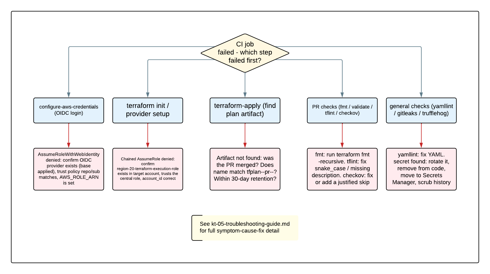

# KT-05: Troubleshooting Guide

This guide helps you diagnose and fix the most common failures when working with the Region 20 data lake infrastructure. It is written for engineers **new to AWS, Terraform, and GitHub Actions**. Each problem is presented as **Symptom -> Cause -> Fix** so you can scan for the message you are seeing and jump straight to the resolution.

> **What is Terraform / CI/CD?**
> Terraform is the **Infrastructure as Code (IaC)** tool that turns `.tf` text files into real AWS resources. CI/CD (Continuous Integration / Continuous Delivery) is the automated **GitHub Actions** pipeline that runs the plan and apply for you on every pull request and merge. If these are new to you, read [KT-03](kt-03-deployment-guide.md) first.

Unfamiliar terms are defined in the [concepts glossary](concepts-glossary.md).



*A decision tree for triaging a failed run: start by identifying which stage failed (authentication, plan, apply, or a local check), then follow the matching section below.*

### How to triage: which stage failed?

Open the failed workflow run in the GitHub **Actions** tab and find the **first** step that shows a red X. The step name tells you which section to read:

| First failing step | Likely area | Go to |
|---------------------|-------------|-------|
| `Configure AWS credentials using OIDC` | Authentication (before Terraform) | [Section 3](#3-oidc-assumerolewithwebidentity-accessdenied-before-terraform-runs) |
| `Terraform Init` or first API call | Chained role / state backend | [Sections 4](#4-chained-assumerole-accessdenied-into-the-execution-role) and [6](#6-state-backend-access-denied) |
| `Terraform Apply` with "no plan artifact" | Artifact handoff | [Section 1](#1-apply-cannot-find-the-plan-artifact) |
| `Terraform Format / Validate / TFLint / Checkov` | Code checks | [Sections 7](#7-checkov-and-tflint-skip-patterns) and [8](#8-debugging-terraform-validate-and-terraform-init) |
| A check in the PR gate (yamllint, gitleaks, trufflehog) | Local/repo checks | [Sections 9](#9-running-all-checks-locally-before-pushing) and [10](#10-trufflehog-secret-scan-failures) |

## Common CI/CD failures

### 1. Apply cannot find the plan artifact

**Symptom.** After merging, the `Terraform Apply` job fails with a message like:
```
Error: No plan artifact found. Cannot apply without verified plan.
```
or the "Find workflow run for plan artifact" step reports it could not locate `tfplan-<stack>-pr-<number>-<env>`.

**Cause.** The apply job deliberately refuses to run without the exact plan that was reviewed on the PR (this is the safety guarantee of the reviewed-plan handoff). It could not match the artifact because one of these is true:
- The PR was **closed without merging**, so no merge commit links to it.
- The plan step on the PR **failed**, so no artifact was ever uploaded.
- The artifact **expired** (artifacts are kept for 30 days).
- The **environment name** in the artifact does not match the tfvars filename.

**Fix.**
- [ ] Confirm the PR was actually **merged** (not closed). Only a merge to `main` triggers apply.
- [ ] On the original PR's workflow run, confirm the plan succeeded and the artifact `tfplan-<stack>-pr-<number>-<env>` was uploaded (check the run's **Artifacts** section).
- [ ] Confirm the artifact has not passed its **30-day retention**. If it expired, you must regenerate it: open a trivial new PR for the stack to produce a fresh plan, then merge that.
- [ ] Confirm the environment name exactly matches the tfvars filename (for example the `dev` artifact corresponds to `variables/dev.tfvars`).

This is also covered, with the multi-environment matrix angle, in [deployment_with_artifacts.md](deployment_with_artifacts.md#apply-cannot-find-plan-artifact).

### 2. Plan/apply mismatch or stale plan

**Symptom.** The apply runs against a plan that no longer reflects reality, or you suspect the deployed result differs from what was reviewed on the PR.

**Cause.** In this repository the apply replays the **exact** saved `tfplan` and never re-plans, so a true silent mismatch is rare by design. The realistic cause is a **stale plan**: the PR sat open for a while, the live AWS state drifted (someone changed a resource by hand, or another PR merged first and changed shared infrastructure), and the saved plan was computed against the older state. Terraform detects this and the apply fails with a message like:
```
Error: Saved plan is stale
The given plan file can no longer be applied because the state was changed by another operation after the plan was created.
```

**Fix.**
- [ ] **Regenerate the plan.** Push a new commit to the PR branch (or re-run the workflow) so a fresh plan is produced against the current state. See [KT-03 section 5](kt-03-deployment-guide.md#5-how-to-trigger-a-re-plan-on-an-open-pr).
- [ ] **Re-review the new plan.** Because state changed, the new plan may differ. Read the `+ / ~ / - / -/+` lines again before merging.
- [ ] **Avoid manual AWS changes.** Out-of-band changes in the console cause drift. If a manual change was necessary, run a plan afterward so Terraform records and reconciles it.

### 3. OIDC `AssumeRoleWithWebIdentity` AccessDenied (before Terraform runs)

**Symptom.** The job fails at the **`Configure AWS credentials using OIDC`** step (before any Terraform command), with an error containing `AssumeRoleWithWebIdentity` and `AccessDenied` or `Not authorized to perform sts:AssumeRoleWithWebIdentity`.

> **What is happening here?**
> This is the **first** authentication hop: GitHub's short-lived OIDC token is being exchanged for credentials on the central CI role `region-20-terraform-role`. A failure here means AWS does not trust the token. Terraform has not started yet.

**Cause and Fix.**
- [ ] **The OIDC provider does not exist** in the Services account. It is created by the `base` stack (`terraform/base/oidc.tf`). Confirm `base` has been applied. The provider ARN is `arn:aws:iam::471624149663:oidc-provider/token.actions.githubusercontent.com`.
- [ ] **The repository does not match the trust policy.** The central CI role trusts the `sub` (subject) claim for specific repositories. This repository trusts both `caylent/region-20-infrastructure` and `esc-region-20/r20-data-lake-infrastructure`. If the workflow runs from a **fork** or a different repo, the token's `sub` will not match and AWS denies it.
- [ ] **`AWS_ROLE_ARN` is wrong or empty.** Confirm the repository variable resolves to `arn:aws:iam::471624149663:role/region-20-terraform-role` (see [section 5](#5-aws_role_arn-empty-or-role-not-found)).
- [ ] **The audience is overridden.** The `aud` claim must be `sts.amazonaws.com`. Do not override the audience in the workflow.

The full explanation, including the trust policy JSON, is in [oidc_role_chain.md](oidc_role_chain.md#accessdenied-on-assumerolewithwebidentity).

### 4. Chained `AssumeRole` AccessDenied into the execution role

**Symptom.** The job gets **past** the OIDC step but fails during **`Terraform Init`** or at the first AWS API call, with `AccessDenied` while assuming `region-20-terraform-execution-role`.

> **What is happening here?**
> This is the **second** authentication hop. The central CI role now has credentials and Terraform is trying to "chain-assume" the per-account execution role in the target account (dev, prod, audit). The target account is chosen by `account_id` in the environment's tfvars. A failure here means the **target account** does not trust, or cannot reach, the central CI role.

**Cause and Fix.**
- [ ] **The execution role does not exist** in the target account. Confirm a role named exactly `region-20-terraform-execution-role` exists there.
- [ ] **The execution role's trust policy is wrong.** It must allow `sts:AssumeRole` from `arn:aws:iam::471624149663:role/region-20-terraform-role` — exactly, with no typo and no stale old role name.
- [ ] **`account_id` is wrong in tfvars.** If `terraform/<stack>/variables/<env>.tfvars` has the wrong `account_id`, Terraform builds the assume-role ARN for the wrong account. Verify against the account map: Dev `784590287037`, Prod `029750300494`, Audit `627896767065`, Services `471624149663`.
- [ ] **A permissions boundary blocks it.** If the central CI role has a permissions boundary, confirm it permits `sts:AssumeRole`.
- [ ] **Diagnose from the target side.** Look in the **target account's** CloudTrail for the `AssumeRole` denial event — it names the exact reason.

Full detail in [oidc_role_chain.md](oidc_role_chain.md#accessdenied-on-the-chained-assumerole).

### 5. `AWS_ROLE_ARN` empty or role not found

**Symptom.** The workflow fails with an empty `role-to-assume`, a message that the role ARN is blank, or `configure-aws-credentials` complaining it received no role.

**Cause.** The repository variable `AWS_ROLE_ARN` is not set, is set at the wrong scope, or is misspelled. The orchestrator workflow reads `${{ vars.AWS_ROLE_ARN }}` and forwards it; if it is empty, the credentials step has nothing to assume.

**Fix.**
- [ ] In GitHub, go to **Settings -> Secrets and variables -> Actions -> Variables** and confirm `AWS_ROLE_ARN` exists at the **repository** level (not only inside an Environment), with value `arn:aws:iam::471624149663:role/region-20-terraform-role`.
- [ ] Confirm there are **no per-environment variants** like `AWS_ROLE_ARN_dev`. This repository uses a **single** `AWS_ROLE_ARN`; per-env variants from the older design do nothing here (see [KT-03 section 6](kt-03-deployment-guide.md#6-the-github-repository-variables-you-actually-need)).
- [ ] If in doubt, temporarily echo the value from a workflow step to confirm it resolves (the ARN is not a secret).

### 6. State backend access denied

**Symptom.** `Terraform Init` fails to access the state bucket, with an S3 `AccessDenied` or a KMS `AccessDenied` on the state key, or it cannot read/write `terraform.tfstate`.

> **What is the state backend?**
> The state backend is the S3 bucket where Terraform stores its record of what it manages. This repository uses bucket `region-20-tf-state` in the Services account (`471624149663`), encrypted with KMS key `arn:aws:kms:us-east-1:471624149663:key/77d58064-e84b-4646-ae3d-180ec68f4625`. State is read/written by the **central CI role** *before* Terraform chain-assumes the execution role, so this is a permissions issue on the central role, not the execution role.

**Cause and Fix.**
- [ ] **Central CI role lacks state permissions.** Confirm `region-20-terraform-role` has `s3:GetObject`, `s3:PutObject`, `s3:ListBucket`, and (because of `use_lockfile = true`) `s3:DeleteObject` on the state key path, plus `kms:Decrypt` and `kms:GenerateDataKey` on the state KMS key.
- [ ] **Backend block mismatch.** Confirm the `bucket` and `kms_key_id` in the stack's `terraform.tf` match the values above.
- [ ] **Wrong account assumption.** Remember the execution role in dev/prod **cannot** read the state bucket — state access is always via the central CI role. If you see the execution role's ARN in the denial, the chain ran in the wrong order.

Full detail in [oidc_role_chain.md](oidc_role_chain.md#state-backend-access-denied). Note there is **no DynamoDB lock table** — locking is S3-native; if a lock is stuck, see [KT-04 section 5](kt-04-operations-runbook.md#5-manually-unlock-terraform-state).

## 7. Checkov and tflint skip patterns

> **What are Checkov and tflint?**
> **Checkov** is a security scanner that checks Terraform for misconfigurations (unencrypted buckets, over-broad IAM, public access, etc.). Each rule has an ID like `CKV_AWS_145`. **tflint** is a linter that enforces naming and style conventions (snake_case names, typed and documented variables, pinned module versions, `#` comments). Both run automatically on every PR via the [terraform_checks.yaml](terraform_checks.md) workflow.

### When a skip is legitimate vs masking a real problem

A "skip" tells Checkov to ignore a specific finding. Skipping is sometimes correct and sometimes dangerous:

| Skip is **legitimate** when... | Skip is **masking a problem** when... |
|--------------------------------|----------------------------------------|
| The finding is a confirmed false positive (for example a doc-comment matched as a secret). | You skip because you do not understand the finding. |
| A documented project decision makes the control not applicable (for example using SSE-S3 instead of KMS for now). | You skip to "make CI green" under time pressure without a written reason. |
| The control does not apply to the resource's threat model, and you wrote down why. | The control genuinely applies and the fix is to change the resource, not silence the alarm. |

> **The rule: every skip must carry a written justification.** The reason comment is the audit trail. A skip with no reason is not allowed.

### Repository-wide skips (`.config/.checkov.yaml`)

Some skips apply everywhere and are listed once, each with a documented reason, in `.config/.checkov.yaml`. Real examples currently in that file:

- `CKV_TF_1` — module sources need a commit hash (waived; the repo pins by version tag).
- `CKV_TF_3` — state-file locking (fails spuriously when backend config is passed via `-backend-config`).
- `CKV_AWS_145` — KMS encryption on S3 (waived; using SSE-S3 / AES256 per the current project security requirement; KMS can be added later).
- `CKV_AWS_18` — S3 access logging (waived; audit trail is handled via CloudTrail).
- `CKV_AWS_355` / `CKV_AWS_356` — `*` as a statement resource for restrictable actions (waived for intentional wildcard IAM).

Add to this file **only** when the same skip applies consistently across the whole repository, and always include the reason inline.

### Per-resource skips (inline)

When a skip applies to **one** resource only, put it **inside** that resource block as an inline comment:

```hcl
module "github_oidc" {
  #checkov:skip=CKV_AWS_274: Disallow IAM roles using the AdministratorAccess policy

  source = "../modules/oidc-provider"
  # ...
}
```

This is the real pattern used in `terraform/base/oidc.tf`. The text after the colon is the mandatory justification.

> **Plan-file scanning caveat.** On PRs, Checkov scans the **plan JSON** (`tfplan.json`), and plan-file scanning does **not** honor inline `#checkov:skip` annotations. That is why some checks that are skipped inline in code (for example the DataEngineer dev-policy checks `CKV_AWS_286`–`CKV_AWS_290`) are **also** listed in `.config/.checkov.yaml`, so they are skipped during plan scanning too.

### How tflint failures map to rules

tflint failures point at a style/naming convention defined in `.config/.tflint.hcl`. Common ones and their fixes:

| tflint complaint | The rule | Fix |
|------------------|----------|-----|
| A variable/output/resource name is rejected | `terraform_naming_convention` (snake_case) | Rename to `snake_case` (for example `myVar` -> `my_var`). |
| "variable has no type" | `terraform_typed_variables` | Add an explicit `type = ...`. |
| "variable/output has no description" | `terraform_documented_variables` / `terraform_documented_outputs` | Add a `description`. |
| "missing required_providers / required_version" | `terraform_required_providers` / `terraform_required_version` | Add the `terraform { required_version, required_providers }` block. |
| "// comment" rejected | `terraform_comment_syntax` | Use `#` instead of `//`. |
| "module source not pinned/versioned" | `terraform_module_pinned_source` / `terraform_module_version` | Pin the module to a version. |
| "declared but never used" | `terraform_unused_declarations` | Remove the unused variable/local/data source. |

Run tflint locally to see exactly which rule fired (see [section 9](#9-running-all-checks-locally-before-pushing)).

## 8. Debugging `terraform validate` and `terraform init`

> **What do these do?**
> `terraform init` downloads the providers and sets up the backend so the directory is ready to use. `terraform validate` checks that your configuration is internally consistent (correct syntax, valid references, matching types) **without** contacting AWS.

### Symptom: `terraform init` fails downloading providers / version mismatch

**Cause.** The installed Terraform version does not satisfy a stack's `required_version`, or a provider version constraint cannot be met.

**Fix.**
- [ ] Check the stack's `terraform.tf` `required_version` (for example `>= 1.11.0`) and the AWS provider constraint (`~> 6.0`).
- [ ] Match your local Terraform to the toolchain. `mise.toml` pins `1.14.3` locally; CI defaults to `1.11.3`. If you switched versions, run `mise install` to materialize the pinned one.
- [ ] If the lock file is stale, re-resolve providers with `terraform init -upgrade`.

### Symptom: `terraform init` keeps trying to use an old backend

**Cause.** The backend configuration changed but Terraform cached the old one.

**Fix.**
- [ ] Re-initialize with `-reconfigure` to discard cached backend settings:
  ```bash
  terraform init -reconfigure
  ```
- [ ] If you intend to **move** state between backends (for example local <-> S3 during bootstrap), use `-migrate-state` instead — see [KT-04 section 1](kt-04-operations-runbook.md#1-bootstrap-the-base-stack-from-scratch-local-state---s3).

### Symptom: `terraform validate` fails

**Cause.** A genuine configuration error (a typo in a reference, a type mismatch, a missing variable).

**Fix — validate offline, exactly as CI does.** CI validates **without credentials** by disabling the backend. Run the same command locally from the stack directory so you reproduce the CI result:

```bash
terraform init -upgrade -input=false -lock=false -reconfigure -backend=false
terraform validate
```

> **Why `-backend=false`?** It tells Terraform to skip connecting to the S3 backend, so `validate` runs offline and needs no AWS credentials. This is the exact offline-validation command documented in the project `CLAUDE.md`, and it is what catches real config errors (including dependency cycles) before you push.

## 9. Running all checks locally before pushing

Running the checks on your machine first means you catch failures in seconds instead of waiting for CI. Run these from the **repository root** unless noted.

> **What is pre-commit?**
> `pre-commit` is a tool that runs a configured set of checks automatically every time you commit. This repository's hooks are defined in `.pre-commit-config.yaml`.

- [ ] **Run every pre-commit hook at once** (format, tflint, terraform-docs, checkov, yamllint, trufflehog, ruff, conventional-commit):
  ```bash
  pre-commit run --all-files
  ```

- [ ] **Terraform formatting** (CI runs the `-check` form, which fails if anything is unformatted):
  ```bash
  terraform fmt -check -recursive
  ```
  To auto-fix formatting, drop `-check`: `terraform fmt -recursive`.

- [ ] **Terraform validate (offline, no credentials)** — from the stack directory:
  ```bash
  terraform init -upgrade -input=false -lock=false -reconfigure -backend=false
  terraform validate
  ```

- [ ] **tflint** — from the repository root, using the shared config:
  ```bash
  tflint --config "$(git rev-parse --show-toplevel)/.config/.tflint.hcl" --recursive
  ```

- [ ] **Checkov security scan**:
  ```bash
  checkov --config-file ./.config/.checkov.yaml -d .
  ```

- [ ] **Python lint (ruff), via mise**:
  ```bash
  mise run lint
  ```

- [ ] **Secret scan (trufflehog), via mise**:
  ```bash
  mise run trufflehog-scan
  ```

> **Conventional Commits.** Your commit **message** is also checked (by the `conventional-pre-commit` hook at commit time). Messages must follow Conventional Commits, for example `feat: add monitoring stack` or `fix(security): tighten dev policy`. A non-conforming message is rejected before the commit is created.

The PR gate runs the same `terraform_checks` and `general_checks` workflows — details in [terraform_pull_request.md](terraform_pull_request.md), [terraform_checks.md](terraform_checks.md), and [general_checks.md](general_checks.md).

## 10. trufflehog secret-scan failures

> **What is trufflehog?**
> trufflehog scans your code and git history for **secrets** — things like AWS access keys, passwords, API tokens, or private keys that must never be committed. It runs as a pre-commit hook and (as gitleaks) in the CI general checks.

**Symptom.** A commit or the `Detect Secrets` CI job fails, reporting a detected credential at a file and line.

**Cause.** A real secret was added to a tracked file, **or** a non-secret string was mistaken for one (a false positive).

### Fix for a real secret (most serious — act fast)

A secret committed to git is compromised even if you delete it later, because it remains in history.

- [ ] **Step 1 — Rotate the secret immediately.** Treat it as leaked: in the issuing system (AWS, the third-party API, etc.) revoke the exposed credential and generate a new one. Rotation is the only thing that actually makes the leak safe.
- [ ] **Step 2 — Remove it from the working tree.** Delete the secret from the file. Replace it with a reference to a managed secret store.
- [ ] **Step 3 — Store it correctly.** Put the new secret in **AWS Secrets Manager** (or SSM Parameter Store) and have Terraform/your app read it from there at runtime, never hardcode it. Several stacks already manage secrets this way (for example `terraform/ingestion/gdrive_sync_secrets.tf`).
- [ ] **Step 4 — Scrub it from history if it was already pushed.** If the secret reached a shared branch, removing it from the latest commit is not enough — it lives in history. Coordinate a history rewrite (for example `git filter-repo`) with the team, since it rewrites shared commits. Rotation in Step 1 remains the primary safeguard.

### Fix for a false positive

Sometimes the flagged string is not a real secret (for example a constant or a doc comment inside a vendored dependency). The repository already documents two such cases in `.config/.checkov.yaml`: `CKV_SECRET_4` and `CKV_SECRET_6` are skipped because the matches are doc comments / constant names in lambda-layer dependencies (urllib3 and google-auth), not real credentials.

- [ ] **Confirm it is truly not a secret** — inspect the exact match. Do not waive a real credential.
- [ ] **For the secret-scan portion of Checkov**, add the specific `CKV_SECRET_*` ID to `skip-check` in `.config/.checkov.yaml` with a written reason (follow the existing examples).
- [ ] **Prefer scoping the scan path.** `.config/.checkov.yaml` already excludes vendored paths (for example `terraform/ingestion/lambda/python`) via `skip-path`. If the false positive is in a vendored directory, excluding the path is cleaner than waiving a rule globally.

> **Never silence a secret finding without verifying it is a false positive.** When in doubt, rotate and remove — a wrongly-ignored real secret is far costlier than a few minutes spent confirming.

## Related deep-dive documents

- [KT-03: Deployment Guide](kt-03-deployment-guide.md) — the CI/CD plan/apply pipeline, OIDC auth, and reading plan artifacts.
- [KT-04: Operations Runbook](kt-04-operations-runbook.md) — bootstrap, destroy, workspaces, failed-apply recovery, and manual state unlock.
- [deployment_with_artifacts.md](deployment_with_artifacts.md) — full plan-artifact handoff and matrix troubleshooting.
- [oidc_role_chain.md](oidc_role_chain.md) — the OIDC role chain and its specific `AccessDenied` troubleshooting sections.
- [terraform_pull_request.md](terraform_pull_request.md) — the PR validation gate and branch protection.
- [terraform_checks.md](terraform_checks.md) — the credential-free Terraform checks workflow (fmt, validate, tflint, checkov).
- [general_checks.md](general_checks.md) — YAML lint and secret-scan (gitleaks) checks.
- [concepts-glossary.md](concepts-glossary.md) — plain-language definitions of every term used here.
