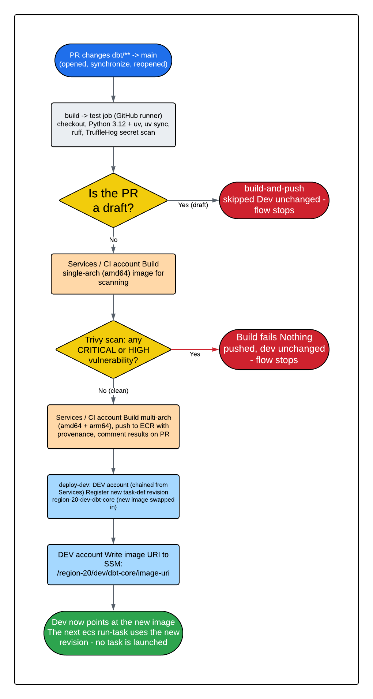
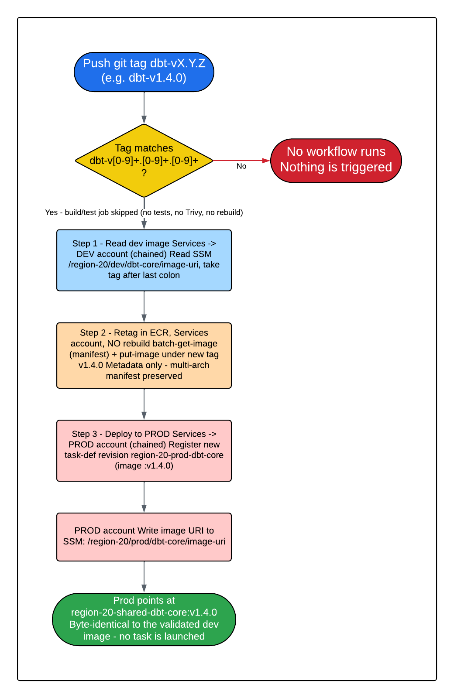

# KT-06: dbt Container Build-and-Deploy Pipeline

This guide explains how the **dbt** transformation code gets packaged into a container image and shipped to the dev and prod AWS accounts in the data platform.

This pipeline is separate from the Terraform plan/apply pipeline described in [KT-03: Deployment Guide](kt-03-deployment-guide.md). That pipeline manages *infrastructure* (the cluster, the IAM roles, the parameter store entry). **This** pipeline manages the *application*, the dbt code itself, built into a container and promoted between environments.

> **What is dbt?**
> dbt ("data build tool") is an open-source tool that runs SQL transformations against a data warehouse. In this repository the dbt project is called `r20_esc` and lives under `dbt/r20_esc/`. It reads lightly-cleaned data and produces curated tables. We do not install dbt on a server — we package it and its SQL models into a container image so it runs the same way everywhere.

> **What is a container image?**
> A container image is a self-contained, read-only package that bundles an application together with everything it needs to run (here: Python, dbt, the `r20_esc` project, and the connection profiles). You build the image once, then run identical copies of it anywhere. Docker is the tool that builds and runs these images.

> **What is ECR?**
> ECR ("Elastic Container Registry") is the AWS service that stores container images. Think of it as a private, access-controlled warehouse for the images we build. Our images live in a single ECR repository named `region-20-shared-dbt-core`.

> **What is ECS / Fargate?**
> ECS ("Elastic Container Service") is the AWS service that runs containers. **Fargate** is the "serverless" mode of ECS: you hand AWS a *task definition* (a recipe naming the image to run, the CPU/memory, and the environment variables) and AWS runs it without you managing any servers. The dbt container runs on Fargate.

> **What is a task definition?**
> A task definition is the immutable recipe ECS follows to launch a container. Each time the recipe changes (for example, to point at a newer image) ECS stores a **new revision** (revision 1, revision 2, and so on). Older revisions are kept, so you can always roll back by launching an earlier one.

If a term is unfamiliar, check the [concepts glossary](concepts-glossary.md).

## 1. The big picture: two distinct paths

This pipeline has **two completely separate triggers**, and understanding the split is the single most important idea in this document:

| Path | What triggers it | What it does | Who does it |
|------|------------------|--------------|-------------|
| **PR → dev** | Opening (or updating) a pull request that changes `dbt/**` | Builds a fresh image, scans it for vulnerabilities, pushes it to ECR, and ships it to the **dev** account automatically | Anyone opening a PR, fully automatic |
| **tag → prod** | Pushing a git tag named `dbt-vX.Y.Z` | Promotes the image **already validated in dev** to the **prod** account, no rebuild | A human, deliberately, when cutting a release |

The design intent:

- **Dev is continuous and automatic.** Every non-draft PR that touches `dbt/**` builds a new image and deploys it to dev with no extra steps. Dev always holds the latest reviewed change so it can be tested.
- **Prod is explicit and gated by a human.** Nothing reaches prod by accident. A person decides "the image in dev is good, release it" and signals that decision by pushing a version tag. Production is never built from scratch in this step — it reuses the exact image bytes that were already proven in dev.

> **Why split it this way?** Rebuilding an image for prod from source could produce *different bytes* than what was tested in dev (a dependency could have shifted, a base image could have been re-published). By promoting the *same image* dev already ran, prod gets exactly what was validated. The git tag is a human-readable label and an audit record — it is **not** a fresh build. This subtlety is critical and is covered in detail in [section 5](#5-the-prod-promotion-what-actually-gets-promoted).

### PR → dev flow



*PR → dev (fully automatic). A pull request touching `dbt/**` first runs the `test` stage (lint + secret scan). On a non-draft PR a single-architecture image is then built and scanned by Trivy — a CRITICAL or HIGH finding stops the run and nothing is pushed. If the scan is clean, the multi-architecture image is pushed to ECR in the Services/CI account, and `deploy-dev` chains into the Dev account to register a new task-definition revision and record the image in SSM. Colors show which AWS account each step runs in — gray: GitHub runner, orange: Services/CI, blue: Dev. No dbt task is launched; the new image simply becomes the default for the next run.*

### tag → prod promotion flow



*tag → prod (deliberate, human-gated). Pushing a git tag `dbt-vX.Y.Z` runs only the promotion job — the build/test job is skipped entirely, so nothing is re-tested or rebuilt. Step 1 reads the image currently recorded for dev from SSM (Services → Dev). Step 2 retags that exact image in ECR under the version tag (Services account; a metadata-only operation — no image bytes move). Step 3 chains into the Prod account to register a new task-definition revision and record the image in SSM. Colors show the account each step runs in — blue: Dev, orange: Services/CI, red: Prod. As in dev, no task is launched.*

## 2. The build pipeline (what produces the image)

The build is done by a **reusable workflow**, a self-contained GitHub Actions workflow that other workflows call like a function.

> **What is a reusable workflow?** A workflow file with an `on: workflow_call` trigger. It accepts inputs and returns outputs, so the same build logic can be reused by many callers. Here, `build_dbt.yml` calls `build_and_push.yml` and passes in the dbt-specific settings.

The reusable workflow is [`build_and_push.yml`](../.github/workflows/build_and_push.yml). The dbt orchestrator [`build_dbt.yml`](../.github/workflows/build_dbt.yml) calls it with these inputs:

| Input | Value for dbt | Meaning |
|-------|---------------|---------|
| `dockerfile_path` | `dbt/Dockerfile` | The recipe used to build the image. |
| `docker_context` | `.` | The repository root is the build context, so the Dockerfile can copy both `dbt/profiles.yml` and `dbt/r20_esc/`. |
| `docker_platforms` | `linux/amd64,linux/arm64` | The image is built for **both** Intel/AMD and ARM CPUs, so it runs on either Fargate architecture. |
| `trivy_severity` | `CRITICAL,HIGH` | The vulnerability scan fails the build if it finds a CRITICAL or HIGH issue. |
| `ecr_repository` | `region-20-shared-dbt-core` | The ECR repository the image is pushed to. |

The reusable workflow runs **two jobs in order**:

### `test` — fail fast before building anything

1. **Checkout** the code.
2. **Set up Python 3.12** and install `uv` (a fast Python package manager).
3. **`uv sync`** — install the Python dependencies.
4. **`ruff check`** — lint the Python code for errors and style issues.
5. **Unit-test step** — currently a placeholder (`echo`), reserved for real tests later.
6. **TruffleHog** — scan the repository for accidentally committed secrets (API keys, passwords). This runs in `continue-on-error` mode, so it reports but does not block.

### `build-and-push` — build, scan, then push

This job only runs for **non-draft pull requests**. It performs these steps:

1. **Set up QEMU and Docker Buildx.** These are the tools that let one machine build images for *multiple* CPU architectures (QEMU emulates the other CPU, Buildx orchestrates the multi-architecture build).
2. **Log in to ECR** using OIDC credentials (see [section 6](#6-authentication-the-three-account-role-chain)).
3. **Generate image tags** with `docker/metadata-action`. One image gets several tags so it can be referenced different ways:

   | Tag style | Example | Purpose |
   |-----------|---------|---------|
   | Short commit SHA | `git-abc1234` | The primary handle, this is the `image-uri` output (the first tag in the generated list). |
   | Long commit SHA | `abc1234…` (full) | Always unique, never reused. |
   | Semantic version | `1.4`, `1.4.0` | Set only when a semver tag is present. |
   | Date + SHA | `20260612-103000-abc1234` | A timestamped tag (default-branch builds). |

   > **Note:** the semantic-version and date+SHA tag styles are inherited from the shared reusable workflow and are not produced here, a pull-request build runs on a PR branch (not a semver git tag, and not the default branch), so only the short-SHA and long-SHA tags are actually created. The short-SHA tag is the one that matters (it is the `image-uri`). Likewise the reusable workflow's `force_build` input is never set by this pipeline (on a tag push the whole `build` job is skipped). Don't go looking for a `:1.4.0` image produced by the build step — the version tag is only ever created later, by the prod promotion (Section 5).

4. **Build a single-architecture (amd64) image and scan it with Trivy.**

   > **What is Trivy?** Trivy is an open-source security scanner. It inspects the image's operating-system packages and language libraries for known vulnerabilities (CVEs). Here it is configured to **fail the build** (`exit-code: 1`) if it finds anything rated CRITICAL or HIGH. A fast single-arch image is built first purely so it can be scanned before spending time on the full multi-arch push.

5. **Build and push the multi-architecture image to ECR**, with `provenance` enabled (a signed record of how and where the image was built, for supply-chain auditing).
6. **Post a build summary** to the workflow run and a **comment on the PR** confirming the image, its digest, and its tags. The comment is posted whether the build succeeds or fails.

The job's `image-uri` output (the short-SHA tag, e.g. `471624149663.dkr.ecr.us-east-1.amazonaws.com/region-20-shared-dbt-core:git-abc1234`) is handed to the `deploy-dev` job below.

### What is inside the image

The [`dbt/Dockerfile`](../dbt/Dockerfile) builds the image as follows:

- **Base:** `python:3.12-alpine`, pinned to a specific digest (so the base never silently changes). Alpine is a minimal Linux distribution, which keeps the image small and the vulnerability surface low.
- Installs `uv` and `git`.
- Exports **only the `dbt` dependency group** from `pyproject.toml`/`uv.lock` (using the locked versions) and installs it system-wide.
- Creates a **non-root** user `dbt` (uid/gid 1001) and runs as that user, a security best practice.
- Copies `dbt/profiles.yml` to `~/.dbt/profiles.yml` and the `dbt/r20_esc/` project into the working directory.
- Sets `DBT_PROFILES_DIR=/home/dbt/.dbt` and disables anonymous usage stats.
- **Default command:** `dbt debug --target silver && dbt debug --target redshift_gold` — a connectivity check against both targets. (The real transformation command is supplied at run time when the task is launched; see [section 4](#4-the-dev-deploy-step).)

> **What are the `silver` and `redshift_gold` targets?**
> A dbt "target" is a named connection profile. The `r20_esc` project (defined in `dbt/profiles.yml`) has three:
> - **`bronze`** and **`silver`** use the **Athena** adapter — they read and write data in the S3 data lake, querying through Amazon Athena (a serverless SQL query engine over S3). `silver` is the default target.
> - **`redshift_gold`** uses the **Redshift** adapter with `method: iam` — it connects to the Redshift Serverless "gold" warehouse using short-lived credentials issued on demand from the container's IAM role (so no password is ever stored in the image). The container receives the warehouse endpoint, database, schema, and user through environment variables set by the task definition.

## 3. Where the image lands: one shared ECR repository

All images(dev and prod, every tag) live in a **single** ECR repository, `region-20-shared-dbt-core`, in the **Services account `471624149663`**. This repository is owned by Terraform (the `service-account` stack, in `terraform/service-account/ecr.tf`). The build pipeline only *pushes images and adds tags*, it never creates or modifies the repository itself. The repository is also configured **immutable** (a tag, once written, cannot be overwritten or re-pointed) which is the AWS-level reason the version tags in [section 7.6](#76-how-to-roll-back) can never be reused.

Because there is one shared repository, "promoting to prod" never needs to copy bytes between accounts, it only needs to add a new **tag** to an image that is already there (see [section 5](#5-the-prod-promotion-what-actually-gets-promoted)).

## 4. The dev deploy step

After the image is built and pushed, the `deploy-dev` job ships it to the dev account. It runs **only for non-draft pull requests**. Two things happen:

1. **Register a new dev task-definition revision.** The job reads the *current* dev task definition (`region-20-dev-dbt-core`), swaps `containerDefinitions[0].image` to the freshly built image URI, strips the read-only fields AWS will not accept on registration (auto-managed fields such as the revision number, ARN, and status), and calls `aws ecs register-task-definition`. This creates a **new revision** of the recipe pointing at the new image. Existing environment variables, CPU/memory, and IAM roles are preserved exactly.
2. **Write the image URI to SSM Parameter Store.** The job runs `aws ssm put-parameter --overwrite` on the parameter `/region-20/dev/dbt-core/image-uri`, recording which image is "current" in dev.

> **What is SSM Parameter Store?** AWS Systems Manager Parameter Store is a simple key/value configuration store. Here it holds one string per environment — the image URI currently deployed. It is the **single source of truth** for "what is running in dev," and the prod promotion reads it directly (see [section 5](#5-the-prod-promotion-what-actually-gets-promoted)).

### What "deploy to dev" actually means — read this carefully

This pipeline **registers a new task-definition revision and updates the SSM parameter. It does not start or restart anything.** The dbt task definition is a **standalone task** designed to be launched on demand with `ecs run-task`, the AWS command that starts a single, one-off container that runs to completion and then exits.

The practical consequence:

> **A deploy makes the new image the default for the *next* run — it does not force a run.** Because there is no long-running ECS service, nothing is "rolled out" or restarted. The newly registered revision becomes the latest revision of the family, and the SSM parameter records the new image URI. The next time someone (or an external orchestrator) launches the dbt task, via `aws ecs run-task` against the task family, or referencing the SSM-recorded URI it picks up the new image.

### Ownership: Terraform vs. the pipeline

The SSM parameter and the task-definition *family* are **owned by Terraform** (the `transformations` stack):

- Terraform **creates** the SSM parameter `aws_ssm_parameter.dbt_image_uri` once, with a bootstrap value of `<ecr_repository_url>:initial`, and then **ignores changes to its value** (`lifecycle { ignore_changes = [value] }`). This lets CI overwrite the value freely without Terraform trying to revert it on the next apply.
- Terraform registers the **initial** task-definition revision (reading the current image tag back from the SSM parameter so a Terraform apply never clobbers a CI-deployed tag). CI registers every **subsequent** revision via the AWS CLI.

> **Never hand-edit the SSM parameter or the ECS task definition in the AWS console.** They are Terraform-managed resources. Editing them by hand causes **drift**, the next Terraform apply will fight your change, or a CLI-registered revision will be lost. The pipeline is the only thing that should write the SSM value and register CI revisions. This is the standing repository rule: never create or edit AWS resources by hand when Terraform owns them.

## 5. The prod promotion: what actually gets promoted

This is the most important section to understand correctly.

When you push a `dbt-vX.Y.Z` tag, the `promote-and-deploy-prod` job runs three steps:

> **A tag push runs only the promotion job — it never re-tests or rebuilds.** On a `dbt-vX.Y.Z` tag the entire `build` job (lint, secret scan, image build, Trivy scan) is skipped, only `promote-and-deploy-prod` runs. Promotion trusts the Trivy scan that already passed on the dev PR. This is the other reason to confirm dev holds the image you intend before tagging, nothing will re-validate it on the way to prod.

### Step 1 — Read the current dev image from SSM

The job assumes the service-account role, chains into the dev account role, and reads `/region-20/dev/dbt-core/image-uri`. It extracts the image's existing tag with `SOURCE_TAG="${IMAGE_URI##*:}"` (everything after the last `:`).

> **This is the crux.** The image promoted to prod is **whatever the dev SSM parameter points to at the moment you push the tag** — *not* the source code at the tagged commit. The git tag's commit is used only for the version **label** and for traceability. The actual **image bytes** come from the current dev image.
>
> **What this means for you:** before you cut a release tag, make sure dev currently holds the image you intend to promote. If a newer, unrelated PR was merged to dev after the change you wanted, dev's SSM parameter now points at *that* image, and *that* is what will go to prod. Confirm dev's state first (see the [pre-flight checklist](#74-pre-flight-checklist)). Neither workflow uses a concurrency lock, so if two dbt PRs build at nearly the same time, both write the dev SSM parameter and the last one to finish wins, another reason to confirm dev's current value before promoting.

### Step 2 — Retag the image in ECR (no rebuild)

The job assumes the service-account role and adds a new tag to the existing image. The new tag is derived from the git tag: `NEW_TAG="${GITHUB_REF_NAME#dbt-}"`, so git tag `dbt-v1.4.0` becomes ECR tag `v1.4.0`.

The retag is done purely through the ECR API:

- `aws ecr batch-get-image` fetches the image **manifest** (the small JSON descriptor that lists the image's layers and architectures) for the source tag.
- `aws ecr put-image` writes that **same manifest** back under the new tag.

> **No image bytes are pulled, rebuilt, or moved.** A container image's layers are content-addressed (stored once and referenced by a fingerprint of their contents). Adding a tag is just writing a new pointer to the existing manifest — an instant, metadata-only operation. This is why promotion is fast and safe: prod runs the **byte-for-byte identical image** that dev validated, just under a friendlier version tag. The multi-architecture manifest is preserved, so both amd64 and arm64 variants carry over.

### Step 3 — Deploy to prod

The job assumes the service-account role, chains into the **prod** account role, and:

1. Registers a **new prod task-definition revision** (`region-20-prod-dbt-core`) with the image set to the retagged URI (`…/region-20-shared-dbt-core:v1.4.0`).
2. Writes that URI to the prod SSM parameter `/region-20/prod/dbt-core/image-uri` with `--overwrite`.

Just as in dev, this **registers a revision and records the parameter — it does not launch a run.** The next prod dbt run uses the new revision.

## 6. Authentication: the three-account role chain

This pipeline touches **three AWS accounts**, and it uses GitHub OIDC so that **no long-lived AWS keys are stored in GitHub**.

> **What is OIDC?** OIDC ("OpenID Connect") lets GitHub prove its identity to AWS using a short-lived, signed token instead of a permanent password. AWS is configured to trust tokens from this repository and exchange them for temporary credentials. The token expires in minutes.

> **What is role-chaining?** "Assuming" a role means temporarily borrowing its permissions. "Chaining" means using one role's credentials to assume a *second* role. Here the pipeline first assumes a role in the Services account, then uses those credentials to assume a role in the dev or prod account (`role-chaining: true` on the `configure-aws-credentials` step).

| Account | AWS Account ID | What it is used for here | GitHub variable |
|---------|---------------|--------------------------|-----------------|
| Services / CI | `471624149663` | Hosts the shared `region-20-shared-dbt-core` ECR repository. The pipeline assumes this role to push, retag, and read images. | `AWS_ROLE_ARN` |
| Dev | `784590287037` | Where the dev task definition and dev SSM parameter live. Assumed by chaining from the Services role. | `AWS_ROLE_ARN_DEV` |
| Prod | `029750300494` | Where the prod task definition and prod SSM parameter live. Assumed by chaining from the Services role. | `AWS_ROLE_ARN_PROD` |

The chain in practice:

- **Build / ECR work** (push, retag) uses only the **Services** role (`AWS_ROLE_ARN`) — that is where the repository lives.
- **Registering a dev task def + writing the dev SSM parameter** assumes `AWS_ROLE_ARN`, then chains into `AWS_ROLE_ARN_DEV`.
- **Registering a prod task def + writing the prod SSM parameter** assumes `AWS_ROLE_ARN`, then chains into `AWS_ROLE_ARN_PROD`.

The required GitHub repository variables for this pipeline:

| Variable | Required? | What it holds |
|----------|-----------|---------------|
| `AWS_ROLE_ARN` | Required | OIDC role in the Services account (`471624149663`) — ECR push/retag/read. |
| `AWS_ROLE_ARN_DEV` | Required | OIDC role in the dev account — dev task-def registration + SSM write/read. |
| `AWS_ROLE_ARN_PROD` | Required | OIDC role in the prod account — prod task-def registration + SSM write. |
| `AWS_REGION` | Recommended | Target region. Defaults to `us-east-1` if unset. |

For the full OIDC model, trust policies, and account onboarding, read [oidc_role_chain.md](oidc_role_chain.md).

## 7. How to promote to production (step-by-step)

Promotion is a deliberate, human action. You promote the image **currently in dev** by pushing a git tag. Follow these steps exactly.

### 7.1 Choose the version number

The tag **must** match the pattern `dbt-v[0-9]+.[0-9]+.[0-9]+` — that is, `dbt-v` followed by a semantic version (`MAJOR.MINOR.PATCH`). For example: `dbt-v1.4.0`.

> **A tag that does not match this pattern triggers nothing.** `dbt-1.4.0` (missing the `v`), `dbt-v1.4` (only two numbers), or `release-1.4.0` will be pushed to GitHub but will **not** start the promotion workflow. Double-check the exact format before pushing.

Pick the next unused version. Increment:
- **PATCH** (`1.4.0 → 1.4.1`) for a small fix.
- **MINOR** (`1.4.1 → 1.5.0`) for new models or backward-compatible changes.
- **MAJOR** (`1.5.0 → 2.0.0`) for breaking changes.

### 7.2 Confirm what is in dev, then create the tag

First, confirm the change you intend to release is the one currently deployed in dev. Find the relevant commit:

```bash
git log --oneline -n 20
```

> **Stop here and confirm.** Remember from [section 5](#5-the-prod-promotion-what-actually-gets-promoted): the bytes that go to prod come from **dev's current image**, not from the commit you tag. If a later, unrelated dbt PR merged after the change you want, dev now points at that newer image — and that is what will be promoted. If unsure, check the dev SSM parameter (see the [pre-flight checklist](#74-pre-flight-checklist)) before tagging.

Create an **annotated** tag. An annotated tag stores a message, author, and date — better for an auditable release record than a lightweight tag.

To tag a **specific commit** (recommended — be explicit about what you are releasing):

```bash
git tag -a dbt-v1.4.0 <commit-sha> -m "Promote dbt image to prod: v1.4.0"
```

Or to tag the **current `HEAD`** of your checked-out branch:

```bash
git tag -a dbt-v1.4.0 -m "Promote dbt image to prod: v1.4.0"
```

### 7.3 Push the tag

Push **the specific tag by name**:

```bash
git push origin dbt-v1.4.0
```

> **Be precise about pushing tags.** A plain `git push` does **not** push tags, it only pushes commits. `git push --tags` pushes *all* local tags at once, which can accidentally publish tags you did not intend to release. Always push the single named tag: `git push origin dbt-v1.4.0`.

### 7.4 Pre-flight checklist

Before pushing the tag, confirm each item:

- [ ] The change you want to release is the image **currently deployed in dev**. Verify the dev parameter value:
  ```bash
  aws ssm get-parameter \
    --name "/region-20/dev/dbt-core/image-uri" \
    --query 'Parameter.Value' --output text \
    --profile dev-data-engineer
  ```
  > **On a different SSO profile,** replace `dev-data-engineer` with your dev profile name.
- [ ] The version number is **not already used**. Check existing tags: `git tag --list 'dbt-v*'`.
- [ ] The tag matches `dbt-v[0-9]+.[0-9]+.[0-9]+` exactly (`dbt-v1.4.0`, not `dbt-1.4.0` or `dbt-v1.4`).
- [ ] You are creating an **annotated** tag (`git tag -a …`).
- [ ] The image in dev passed its Trivy scan when its PR was built (no CRITICAL/HIGH findings).

### 7.5 Watch the run and confirm success

1. Open the repository's **Actions** tab on GitHub.
2. Find the **"Build and Deploy dbt Image"** workflow run triggered by your tag push.
3. Open the **"Promote to PROD"** job and watch its three logical steps: read dev image from SSM, retag in ECR, register the prod revision.

Confirm success by checking three things:

> **These commands query the Services and prod accounts** — add `--profile <your-prod-profile>` (your prod SSO profile) to each, the same way [section 7.4](#74-pre-flight-checklist) uses a dev profile.

- [ ] The job's **"Register new PROD task definition revision"** step logs `Registered: arn:aws:ecs:…:task-definition/region-20-prod-dbt-core:<N>` with a new revision number `<N>`.
- [ ] The retag step created the ECR tag `v1.4.0`. Verify (in the Services account):
  ```bash
  aws ecr describe-images \
    --repository-name region-20-shared-dbt-core \
    --image-ids imageTag=v1.4.0 \
    --query 'imageDetails[0].imageTags' --output json
  ```
- [ ] The prod SSM parameter now ends in `:v1.4.0`:
  ```bash
  aws ssm get-parameter \
    --name "/region-20/prod/dbt-core/image-uri" \
    --query 'Parameter.Value' --output text
  ```

### 7.6 How to roll back

A rollback means pointing prod at a known-good earlier image. Because recent images remain in ECR under their own tags, rolling back is usually just another promotion.

> **You cannot reuse a tag name without deleting it first.** Git refuses to overwrite an existing tag, and re-pushing the same name is bad practice (anyone who already fetched it keeps the old commit). Always roll forward with a **new** version number.

Two practical options:

1. **Cut a new version that promotes the good dev image (preferred).** If dev currently holds (or you redeploy to dev) the known-good change, push a new higher tag — for example `dbt-v1.4.1`. The promotion job retags the current dev image to `v1.4.1` and registers it in prod.

2. **Re-promote a specific earlier image directly.** If the good image already exists in ECR under an earlier tag and you do not want to disturb dev, an operator with prod access can register a prod task-definition revision pointing at that earlier tag and update the prod SSM parameter — mirroring what Step 3 of the pipeline does. Prefer option 1 (going back through the pipeline) so the change is auditable and the SSM parameter stays consistent. Treat the manual route as a break-glass measure.

> **Older images can age out.** ECR's lifecycle policy keeps only the most recent ~10 tagged images per prefix, so a long-superseded image may no longer exist. If the tag you want to roll back to has been pruned, you must rebuild it through a dev PR first (option 1).

> **Rolling back the revision does not stop an in-flight task.** As covered in [section 4](#4-the-dev-deploy-step), the task definition only governs the *next* run. If a bad dbt run is actively executing, stop it with `aws ecs stop-task` in the prod account; registering a new revision alone will not interrupt it.

## 8. Troubleshooting and gotchas

| Symptom | Cause | Fix |
|---------|-------|-----|
| Pushing a tag does nothing — no workflow runs | The tag name does not match `dbt-v[0-9]+.[0-9]+.[0-9]+` | Delete the bad local/remote tag and re-create it in the exact format (`dbt-v1.4.0`). A plain `git push` also does not push tags — push the tag by name. |
| `promote-and-deploy-prod` fails on "Get current DEV image URI from SSM" with `AccessDenied` | The dev role lacks `ssm:GetParameter` | Promotion now reads the image URI from the **dev SSM parameter** (it previously read it from the dev ECS task definition). The dev OIDC role (`AWS_ROLE_ARN_DEV`) must grant `ssm:GetParameter` on `/region-20/dev/dbt-core/image-uri`. This is a recent change — older role policies may predate it. |
| Promotion fails with `ParameterNotFound` for the dev parameter | Dev was never deployed, so the parameter holds only its Terraform bootstrap value — or the `transformations` stack was never applied in dev | Open and merge a dbt PR so `deploy-dev` writes a real image URI, or confirm the `transformations` stack is applied in dev so the parameter exists. |
| Trivy fails the build on a CRITICAL/HIGH finding | A vulnerable OS package or Python dependency is in the image | Update the offending dependency in `pyproject.toml`/`uv.lock` or bump the pinned base-image digest in `dbt/Dockerfile`, then re-push the PR branch. |
| `deploy-dev` is skipped | The PR is a **draft** | `deploy-dev` runs only on non-draft PRs. Mark the PR "Ready for review." |
| Dev/prod task def or SSM value reverts unexpectedly | Someone hand-edited the resource, or Terraform was applied without the CI-managed tag handling | Never hand-edit the SSM parameter or task definition. Let the pipeline manage them. Terraform reads the live tag back from SSM and uses `ignore_changes = [value]` precisely to avoid clobbering CI. |
| A bad image reached prod | A newer-than-intended image was in dev when the tag was pushed | This is the [section 5](#5-the-prod-promotion-what-actually-gets-promoted) subtlety. Verify dev's SSM value *before* tagging next time, and roll forward with a new version (see [section 7.6](#76-how-to-roll-back)). |

For broader CI/CD and OIDC failures, see [KT-05: Troubleshooting Guide](kt-05-troubleshooting-guide.md).

## Related documents

- [KT-03: Deployment Guide](kt-03-deployment-guide.md) — the Terraform plan/apply pipeline that provisions the cluster, IAM roles, and SSM parameter this pipeline depends on.
- [oidc_role_chain.md](oidc_role_chain.md) — the full OIDC authentication model, trust policies, and the per-account role chain used here.
- [dbt / Airbyte Compute Options](dbt_airbyte_compute_options.md) — the compute trade-offs behind running dbt on ECS Fargate (why a standalone task, not a service).
- [monitoring.md](monitoring.md) — the dbt ECS alarms and the EventBridge task-failure rule that alerts on a failed dbt run.
- [KT-05: Troubleshooting Guide](kt-05-troubleshooting-guide.md) — symptom-driven fixes for CI/CD, OIDC, and Terraform failures.
- [concepts-glossary.md](concepts-glossary.md) — plain-language definitions of every term used here.
