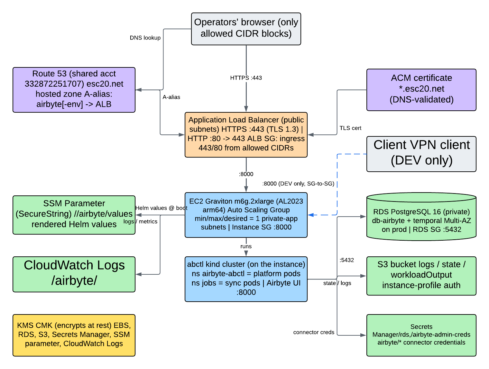
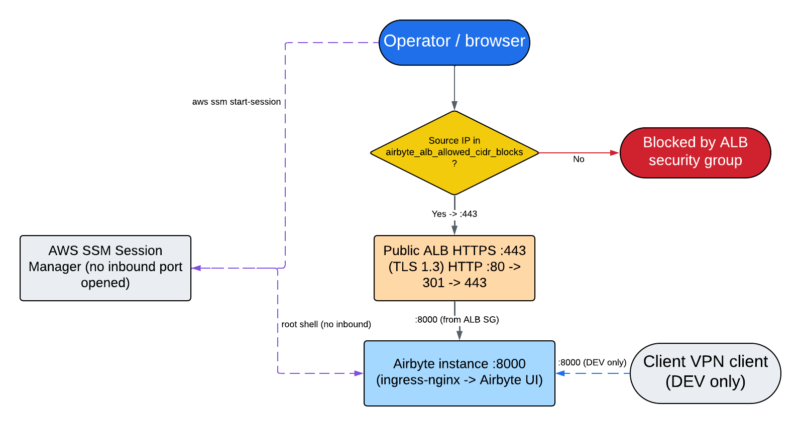
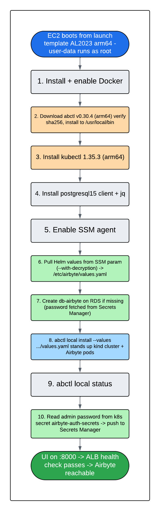

# KT-07: Airbyte Self-Hosted Deployment

This guide explains how **Airbyte OSS** (the open-source edition) is deployed on AWS in this repository, the EC2 server it runs on, the external state it depends on, how the server bootstraps itself, how to reach it, and how to debug it. The infrastructure is owned by the `ingestion` stack (`terraform/ingestion/airbyte.tf`) and the reusable `airbyte` module (`terraform/modules/airbyte/`).

> **What is Airbyte?**
> Airbyte is an open-source data-integration tool. It connects to external source systems (Oracle, MSSQL, Docebo, and others) on a schedule, extracts their data, and lands it in the Bronze layer of the data lake. In this repository Airbyte is *self-hosted*, we run it ourselves on an AWS server rather than paying for Airbyte Cloud. The sources, destinations, and connections that Airbyte actually runs are defined separately, in the `airbyte-connectors` stack.

> **What is abctl?**
> `abctl` ("Airbyte Control") is Airbyte's own vendor-supported command-line installer. `abctl local install` creates a small single-node Kubernetes cluster *inside Docker* on the server (using a project called `kind`, "Kubernetes-in-Docker"), then applies Airbyte's official Helm chart onto it. We chose `abctl` precisely because Airbyte tests, documents, and supports it. Sßee [dbt / Airbyte Compute Options](dbt_airbyte_compute_options.md) for the full rationale.

If a term is unfamiliar, check the [concepts glossary](concepts-glossary.md).

## 1. The big picture

Airbyte 1.x and later is a Kubernetes-native distributed system, it is not a single process. Running a full managed Kubernetes cluster (Amazon EKS) just for one tool would be overkill at the data platform scale, so instead Airbyte runs on **one EC2 virtual server** that hosts a tiny in-Docker Kubernetes cluster, installed and managed by `abctl`.

The single most important idea in this whole document is this:

> **The EC2 server is disposable, the data is not.** Every piece of durable state: Airbyte's configuration, sync history, connector credentials, and logs lives *outside* the server, in managed AWS services (RDS, S3, Secrets Manager, SSM). The Kubernetes cluster on the server holds nothing permanent. If the server dies, the Auto Scaling Group launches a replacement, the replacement re-bootstraps itself, and it reconnects to the exact same external state. Nothing is lost. This design is revisited in [Section 10](#10-operations).

### Architecture



The deployed Airbyte architecture. 
- Gray = clients and edge (operators, the Client VPN) 
- Purple = DNS and TLS (the Route53 record and the ACM certificate) 
- Orange = the public Application Load Balancer
- Blue = compute (the Graviton EC2 instance inside its Auto Scaling Group, running the abctl/kind cluster); 
- Green = external durable state (RDS PostgreSQL, the S3 bucket, Secrets Manager, the SSM parameter, the CloudWatch log group)
- Amber = the KMS customer-managed key that encrypts all of the green resources plus the instance's EBS volume.

### Component overview

| Component | AWS service | Purpose |
|---|---|---|
| Airbyte server | EC2 (Graviton/arm64) in a singleton Auto Scaling Group | Runs the abctl/kind cluster that hosts every Airbyte pod. |
| Public entry point | Application Load Balancer (ALB) | Terminates HTTPS and forwards web-UI traffic to the instance on port 8000. |
| DNS name | Route53 A-alias record in the shared `esc20.net` zone | Resolves `airbyte[-env].esc20.net` to the ALB. |
| TLS certificate | AWS Certificate Manager (ACM) | Wildcard `*.esc20.net` certificate used by the ALB HTTPS listener. |
| Config + workflow database | RDS PostgreSQL 16 | Stores Airbyte configuration and the Temporal workflow engine's state. |
| Logs, state, artifacts | S3 bucket | Holds connector logs, sync state payloads, and workload output. |
| Credentials | Secrets Manager | RDS password, the web-UI admin password, and per-connector credentials. |
| Helm values delivery | SSM Parameter Store (SecureString) | Carries the rendered Helm values file the server reads at boot. |
| Encryption | KMS customer-managed key (CMK) | One key encrypts EBS, RDS, S3, Secrets Manager, SSM, and CloudWatch Logs. |
| System + pod logs | CloudWatch log group `/airbyte/region-20-<env>-airbyte` | Destination for instance and Airbyte logs. |

## 2. Compute: Graviton EC2 behind an Auto Scaling Group

Airbyte runs on a single EC2 instance, but it is never launched directly. It is launched *by* an Auto Scaling Group from a launch template, so the platform can replace it automatically.

> **What is an Auto Scaling Group (ASG)?**
> An ASG is an AWS feature that keeps a target number of EC2 instances running and automatically launches a replacement if one becomes unhealthy or is terminated. Here the target is exactly one, the ASG is used not to *scale* (there is always one server) but to *self-heal*: if the server dies, the ASG rebuilds it.

> **What is a launch template?**
> A launch template is the recipe the ASG follows when it launches an instance: which machine image (AMI) to boot, which instance type, which disk, which security group, which IAM role, and what bootstrap script to run. The ASG creates instances from this recipe.

### This is an arm64 / Graviton deployment

This is the most important accuracy point in this section. **The Airbyte server runs on AWS Graviton (arm64), not Intel/AMD (x86).** Three things must agree for that to work, and they do:

| Layer | Value | Source |
|---|---|---|
| Machine image (AMI) | Amazon Linux 2023, **arm64** kernel, resolved from SSM parameter `/aws/service/ami-amazon-linux-latest/al2023-ami-kernel-default-arm64` | `terraform/ingestion/airbyte.tf` |
| Instance type | `m6g.2xlarge` (AWS Graviton2, 8 vCPU, 32 GB), in **both** dev and prod | `terraform/ingestion/variables/dev.tfvars` and `prod.tfvars` |
| Software | `abctl`, `kubectl`, and every Airbyte container image are pulled as **arm64** builds | `templates/user-data.sh.tpl`, `templates/airbyte-values.yaml.tpl` |

> **Why Graviton?** AWS Graviton (arm64) instances cost roughly 20% less than the equivalent x86 instance for the same vCPU and memory, with comparable or better performance for this kind of steady-state workload. For an always-on server that runs 24/7, that discount applies every hour of every month. The trade-off is that all software must be available as arm64 builds, which, for Airbyte, abctl, and kubectl, it is.

### The launch template

The launch template (`aws_launch_template.this` in the module) sets:

- **AMI:** the arm64 Amazon Linux 2023 image above.
- **Instance type:** `m6g.2xlarge` (from the stack).
- **Root volume:** a 50 GB `gp3` EBS volume, **encrypted with the Airbyte KMS key**, deleted when the instance terminates.
- **IMDSv2 required.** The instance metadata service (the internal endpoint an instance uses to learn its own identity and credentials) is set to `http_tokens = "required"`, which enforces IMDSv2. This blocks a class of server-side request forgery (SSRF) attacks that abuse the older, token-less metadata endpoint.
- **Metadata hop limit of 3.** The metadata response is allowed to traverse up to three network hops. This is deliberately higher than the default of 1 because Docker and the kind cluster add network hops — a container inside the kind cluster that needs the instance's IAM credentials is several hops away from the metadata endpoint. Without a raised hop limit, those in-container AWS calls would fail.
- **User-data:** the bootstrap script described in [Section 6](#6-the-ec2-bootstrap-user-data-step-by-step).
- **Detailed CloudWatch monitoring** enabled.

### The singleton ASG

The Auto Scaling Group (`aws_autoscaling_group.this`) is configured as a strict singleton:

| Setting | Value | Why |
|---|---|---|
| `min_size` / `max_size` / `desired_capacity` | `1` / `1` / `1` | Exactly one Airbyte server at all times. |
| `health_check_type` | `ELB` | The ASG asks the load balancer "is this instance healthy?" rather than relying only on the EC2 hardware check. An instance whose Airbyte UI is not yet responding is considered unhealthy. |
| `health_check_grace_period` | `900` seconds (15 minutes) | The ASG waits 15 minutes before health-checking a new instance, because the first boot — installing Docker, pulling images, running `abctl local install` — takes roughly 7 to 12 minutes. Without this grace period the ASG would kill the instance before it ever finished installing. |
| `instance_refresh` | Rolling, `min_healthy_percentage = 0` | Lets the ASG terminate the existing instance before launching its replacement. For a single-instance group, requiring any healthy percentage would deadlock the refresh (there is only one instance to replace). |
| `lifecycle { ignore_changes = [desired_capacity] }` | — | Terraform will not reset the desired count if an operator manually adjusted it during a maintenance or upgrade window. |

> **Why a one-instance ASG instead of a plain EC2 instance?** A bare EC2 instance that crashes stays down until an operator notices. An ASG with `desired_capacity = 1` automatically launches a replacement. Because all state is external (see [Section 5](#5-external-state-durable-data-lives-outside-the-instance)), that replacement comes up as a fully working Airbyte with no data loss. The cost is a short outage window (roughly 5 to 12 minutes) during replacement, during which scheduled syncs are simply retried later by Temporal.

## 3. Networking, DNS, TLS, and access gating

There is more than one way to reach Airbyte, and each path is gated differently. Understanding the three lanes is essential before you try to open the UI or debug a "can't connect" report.



*The three ways to reach Airbyte. Lane 1 (public ALB): a browser hits `https://airbyte[-env].esc20.net`, which resolves to the internet-facing ALB, the ALB only accepts connections from the explicit allow-list of CIDRs, terminates TLS, and forwards to the instance on port 8000. Lane 2 (Client VPN, dev only): a developer on the Client VPN reaches the instance directly on port 8000, bypassing the ALB — this lane exists only in dev, where `vpn_available = true`. Lane 3 (SSM Session Manager): an operator opens a shell on the instance through AWS Systems Manager, which requires no inbound port at all. Lanes 1 and 2 reach the web UI; lane 3 is for command-line debugging (see [Section 7](#7-connecting-to-the-instance-via-ssm-session-manager)).*

### DNS

> **What is a Route53 A-alias record?**
> Route53 is AWS's DNS service. An "A-alias" record maps a friendly name (like `airbyte-dev.esc20.net`) to an AWS resource (here, the load balancer) rather than to a fixed IP address. Because the ALB's underlying IPs can change, the alias always points at whatever IPs the ALB currently has.

The record name depends on the environment: prod is `airbyte.esc20.net`, every non-prod environment is `airbyte-<env>.esc20.net` (so dev is `airbyte-dev.esc20.net`).

> **The DNS zone lives in a different AWS account.** The `esc20.net` hosted zone is **not** in the dev or prod account, it is in the shared DNS account `332872251707`. Terraform reaches it through a dedicated, aliased provider (`provider = aws.route53`) so it can read the zone and write records there while every other resource is created in the workload account. This is why both the alias record and the certificate-validation record are written via that special provider.

### TLS certificate

> **What is ACM?**
> AWS Certificate Manager (ACM) provisions and renews the TLS/SSL certificates that make HTTPS work. The ALB uses an ACM certificate to encrypt browser traffic.

The certificate is a **wildcard** for `*.esc20.net`, **DNS-validated**. DNS validation means ACM proves domain ownership by checking for a specific CNAME record in the zone — Terraform writes that validation CNAME into the shared `esc20.net` zone (again via the `aws.route53` provider), then waits for ACM to confirm. A single wildcard certificate covers `airbyte.esc20.net`, `airbyte-dev.esc20.net`, and any other `*.esc20.net` name.

### The load balancer

> **What is an Application Load Balancer (ALB)?**
> An ALB is an AWS service that accepts incoming HTTP/HTTPS connections and forwards them to backend targets (here, the Airbyte instance). It is the public endpoint: it terminates HTTPS, enforces who is allowed to connect, and health-checks its targets.

The ALB is **internet-facing** and lives in the public subnets. Its listeners:

| Listener | Port | Behavior |
|---|---|---|
| HTTPS | `443` | Terminates TLS using the ACM certificate; SSL policy `ELBSecurityPolicy-TLS13-1-2-2021-06` (TLS 1.2/1.3 only). Forwards to the target group. |
| HTTP | `80` | Returns an HTTP 301 redirect to HTTPS. No application traffic is ever served over plain HTTP. |

The **target group** forwards to the instance over HTTP on port **8000** (the port Airbyte's internal nginx listens on). Its health check requests path `/` over HTTP and treats any response code in the range **200-399** as healthy. The 200-399 matcher is deliberately broad because the Airbyte UI may answer the root path with a redirect (3xx) rather than a plain 200.

### The three security groups

> **What is a security group?**
> A security group is a virtual firewall attached to an AWS resource. It has *ingress* rules (what is allowed in) and *egress* rules (what is allowed out). Rules can reference IP ranges (CIDRs) or *other security groups* — the latter is tighter, because it grants access to a role rather than to an address.

| Security group | Ingress (in) | Egress (out) |
|---|---|---|
| **ALB SG** | `443` and `80`, **only** from the CIDRs in `airbyte_alb_allowed_cidr_blocks` | `8000` to the instance SG |
| **Instance SG** | `8000` from the ALB SG; **plus** `8000` from the Client VPN SG **in dev only** (when `vpn_available = true`) | `5432` to the RDS SG; `443` to `0.0.0.0/0` (for container-image and AWS API calls); `22` to the OCI bastion and the TAS bastion (for the Oracle and MSSQL source tunnels) |
| **RDS SG** | `5432` **only** from the instance SG | (none defined; RDS has no route out of the VPC by design) |

A few things worth calling out:

- **The UI is never open to the world.** The only way to reach the ALB is from an IP in the explicit allow-list. An empty list locks everyone out.
- **The dev-only VPN rule** is added at the stack level (`aws_vpc_security_group_ingress_rule.airbyte_instance_from_vpn_ui` in `airbyte.tf`), gated on `var.vpn_available`. It references the Client VPN's security group by ID, so VPN clients reach the instance on port 8000 directly. In prod there is no Client VPN, so this rule does not exist.
- **The `443`-to-anywhere egress** is required so the instance can pull Docker/abctl/kubectl binaries and Airbyte container images, and reach AWS APIs not fronted by a VPC endpoint. It is egress only.
- **RDS is private.** The database has `publicly_accessible = false` and accepts connections only from the instance security group, on port 5432.

## 4. External state (durable data lives outside the instance)

This is what makes the server disposable. Every durable thing Airbyte needs is a managed AWS resource that survives instance replacement. All of them are encrypted with the **single Airbyte KMS customer-managed key (CMK)**.

> **What is RDS?**
> RDS (Relational Database Service) is AWS's managed database service. AWS runs the database engine, handles backups, patching, and (optionally) failover, so the team does not operate a database server by hand.

### RDS PostgreSQL 16

A single RDS PostgreSQL 16 instance (`aws_db_instance.this`) holds **two** databases:

- **`db-airbyte`** — Airbyte's own configuration: every connector definition, sync schedule, and job-history record. Losing this database means losing all connection configuration.
- **`temporal`** — the state of the Temporal workflow engine that orchestrates sync jobs.

> **What is Temporal?**
> Temporal is the workflow engine bundled inside Airbyte. It is what decides which sync runs when, retries failed steps, and tracks the progress of each job. It keeps its own bookkeeping in the separate `temporal` database on the same RDS instance.

Key RDS settings:

| Setting | Value |
|---|---|
| Engine / version | PostgreSQL `16` |
| Instance class | `db.t3.micro` (dev) / `db.t3.small` (prod) |
| Storage | `gp3`, 20 GB allocated, autoscaling up to 100 GB |
| Encryption | Encrypted at rest with the Airbyte KMS key |
| Multi-AZ | **prod only** (`airbyte_rds_multi_az = true` in prod, `false` in dev) |
| Observability | Performance Insights enabled; enhanced monitoring at 60-second interval; PostgreSQL logs exported to CloudWatch |
| Backups | 7-day automated backup retention |
| Master password | A 32-character `random_password` generated by Terraform and stored in Secrets Manager — never written into code |

> **What is Multi-AZ?**
> "Multi-AZ" means AWS keeps a synchronized standby copy of the database in a second Availability Zone (a physically separate data center). If the primary fails, AWS automatically promotes the standby with no manual intervention. It roughly doubles the database cost, which is why it is enabled only in prod.

### S3 bucket

A dedicated S3 bucket (named `region-20-<env>-airbyte`) stores Airbyte's logs, sync state payloads, and workload output. It is configured:

- **KMS-encrypted** (Airbyte CMK), with bucket keys enabled to reduce KMS API cost.
- **Versioned**, so overwritten or deleted objects can be recovered.
- **Public access fully blocked** (all four S3 public-access-block settings on).
- A **90-day lifecycle expiration** on objects under the `logs/` prefix, plus automatic cleanup of incomplete multipart uploads after 7 days.

> **The instance authenticates to S3 with its IAM role — there are no access keys.** Airbyte is configured with `authenticationType: instanceProfile`. The EC2 instance carries an IAM instance profile whose role grants it the S3 access it needs, so Airbyte reads and writes the bucket using temporary, automatically rotated credentials. No long-lived AWS access key is ever stored in the Helm values, on disk, or in the database.

### Secrets Manager

> **What is Secrets Manager?**
> AWS Secrets Manager is an encrypted store for sensitive values (passwords, API keys). Applications fetch a secret at runtime by name instead of having the value baked into code or config.

Three categories of secret, all encrypted with the Airbyte CMK:

| Secret | Name | Contents |
|---|---|---|
| RDS credentials | `region-20-<env>-airbyte/rds` | The PostgreSQL username, password, host, port, and database name. Written by Terraform. |
| Web-UI admin credentials | `region-20-<env>-airbyte/airbyte-admin-creds` | The Airbyte web-UI admin password. **Populated at instance boot** (see [Section 6](#6-the-ec2-bootstrap-user-data-step-by-step)), not by Terraform. |
| Connector credentials | `airbyte/*` | The credentials for each source/destination, stored by Airbyte itself under the `airbyte/` prefix at runtime. |

### SSM SecureString — the Helm values

> **What is SSM Parameter Store?**
> AWS Systems Manager (SSM) Parameter Store is a key/value configuration store. A "SecureString" parameter is encrypted with KMS. Here it carries one thing: the fully-rendered Airbyte Helm values file.

The parameter `/region-20-<env>-airbyte/airbyte/values` is a **SecureString** encrypted with the Airbyte CMK. It is created on the **Advanced** tier because the rendered values file exceeds the 4 KB Standard-tier size limit. The instance reads this parameter at boot to learn how to install Airbyte (see [Section 5](#5-the-helm-values-file-what-is-customized) for the contents).

### KMS and CloudWatch Logs

A single KMS customer-managed key (`aws_kms_key.airbyte`, alias `alias/region-20-<env>-airbyte`) encrypts **everything**: the EBS root volume, RDS storage, S3 objects, Secrets Manager secrets, the SSM SecureString, and the CloudWatch log group. Key rotation is enabled. The key policy grants the root account full administration, grants the EC2 Auto Scaling service-linked role the access it needs to encrypt EBS volumes, and grants CloudWatch Logs the access it needs to write to the Airbyte log group.

The CloudWatch log group `/airbyte/region-20-<env>-airbyte` is the destination for instance and Airbyte logs, encrypted with the same key, with retention set by `airbyte_log_retention_days` (30 days in both environments).

## 5. The Helm values file (what is customized)

> **What is a Helm values file?**
> Helm is the package manager Kubernetes uses to install applications. A "values file" is the set of overrides that customize a Helm chart for a specific deployment — telling it, for example, "use this external database instead of the built-in one." Airbyte ships a stock chart with defaults; our values file overrides the defaults that matter for AWS.

The values file is the template `terraform/modules/airbyte/templates/airbyte-values.yaml.tpl`. Terraform renders it (filling in the real RDS host, S3 bucket name, URL, and so on) and stores the result in the SSM SecureString parameter. At boot the instance pulls it down and hands it to `abctl local install`.

The stock upstream chart, by default, runs an *internal* PostgreSQL database and an *internal* MinIO object store inside the cluster, both of which would live on the disposable instance and be lost on replacement. The full upstream schema (showing those stock defaults) is kept in the repo at `terraform/modules/airbyte/templates/../values.yaml` for reference. Our overrides redirect every stateful component to a managed AWS service instead:

| Override | What it does |
|---|---|
| `global.database.type = external` + host/port/db/user/password | Point Airbyte's config DB at the external RDS instance and the `db-airbyte` database. |
| `temporal.database` (host/port/db/user/password) | Point Temporal at the **same** RDS instance but the separate `temporal` database. |
| `global.storage.type = S3` + `authenticationType: instanceProfile` | Use the S3 bucket for logs/state/workloadOutput, authenticated by the instance's IAM role (no keys). |
| `minio.enabled = false` | Disable the built-in MinIO object store (S3 replaces it). |
| `postgresql.enabled = false` | Disable the built-in in-cluster PostgreSQL (RDS replaces it). |
| arm64 image digests pinned per component | Every Airbyte component (server, worker, temporal, cron, bootloader, etc.) is pinned to a specific **arm64 (Graviton)** image digest, so the cluster runs the exact, reproducible arm64 builds. |
| `global.airbyteUrl` | Set to the public HTTPS URL so Airbyte builds correct redirect URLs. |
| `global.auth.enabled = true` | Require login to the web UI. The admin password is auto-generated at install time (see [Section 6](#6-the-ec2-bootstrap-user-data-step-by-step)). |

A trimmed excerpt of the two most important blocks (the full file is in the template — do not copy this verbatim):

```yaml
global:
  airbyteUrl: "https://airbyte-dev.esc20.net"
  auth:
    enabled: true
  database:
    type: "external"          # external RDS, not in-cluster Postgres
    host: "<rds-endpoint>"
    port: 5432
    database: "db-airbyte"
    user: "airbyte"
    password: "<from-terraform>"
  storage:
    type: S3                  # S3, not in-cluster MinIO
    bucket:
      log: "region-20-dev-airbyte"
      state: "region-20-dev-airbyte"
      workloadOutput: "region-20-dev-airbyte"
    s3:
      region: "us-east-1"
      authenticationType: instanceProfile   # IAM role, no access keys
```

## 6. The EC2 bootstrap (user-data), step by step

> **What is user-data?**
> "User-data" is a script the EC2 instance runs automatically the first time it boots. It is how a fresh, generic Amazon Linux image turns itself into a working Airbyte server with no manual steps. The script lives in `terraform/modules/airbyte/templates/user-data.sh.tpl`.



*The boot sequence. The diagram traces the ten user-data steps below in order, from the moment the EC2 instance powers on through to "Airbyte UI reachable" — installing the container runtime and tools, pulling the Helm values, preparing the database, installing Airbyte, and finally publishing the generated admin password.*

The script runs as root with `set -euxo pipefail` (it stops on the first error). Its ten blocks:

1. **Install Docker.** Installs the Docker engine if it is not already present, enables and starts it, and adds the `ec2-user` and `ssm-user` accounts to the `docker` group.
   ```bash
   dnf install -y docker
   systemctl enable --now docker
   ```

2. **Download and install abctl, with checksum verification.** Detects the CPU architecture (`uname -m` resolves to `arm64` on Graviton), downloads the matching **abctl v0.30.4** release tarball *and* its checksums file from GitHub, verifies the download with `sha256sum --check`, then installs the binary to `/usr/local/bin/abctl`. The version is pinned in the module (`local.abctl_version`) so the binary and its checksum never drift.
   ```bash
   curl -fsSL "$RELEASE_URL/$TARBALL"   -o "$WORKDIR/$TARBALL"
   curl -fsSL "$RELEASE_URL/$CHECKSUMS" -o "$WORKDIR/$CHECKSUMS"
   (cd "$WORKDIR" && sha256sum --check --ignore-missing "$CHECKSUMS")
   install -m 0755 "$WORKDIR/$TARBALL_NAME/abctl" /usr/local/bin/abctl
   ```

3. **Install kubectl.** Downloads **kubectl 1.35.3** (the arm64 build, from the Amazon EKS S3 mirror) along with its checksum, verifies it, and installs it to `/usr/local/bin/kubectl`. This is the tool operators use to inspect the cluster later (see [Section 8](#8-debugging-airbyte-with-kubectl--abctl)).

4. **Install the PostgreSQL client and jq.** Installs `postgresql15` (the `psql` client, used to create the database in step 7 and for connectivity debugging) and `jq` (a JSON parser used in steps 7 and 10).
   ```bash
   dnf install -y postgresql15 jq
   ```

5. **Ensure the SSM agent is running.** The Systems Manager agent is pre-installed on Amazon Linux 2023; this step makes sure it is enabled and started so Session Manager access (see [Section 7](#7-connecting-to-the-instance-via-ssm-session-manager)) works.

6. **Pull the Helm values from SSM.** Reads the SecureString parameter `/region-20-<env>-airbyte/airbyte/values` (with `--with-decryption`), writes it to `/etc/airbyte/values.yaml`, and locks the file down with `chmod 600` (readable only by root, because it contains the database password).
   ```bash
   aws ssm get-parameter --name "$SSM_PARAM" --with-decryption \
     --region "$AWS_REGION" --query Parameter.Value --output text > /etc/airbyte/values.yaml
   chmod 600 /etc/airbyte/values.yaml
   ```

7. **Create the `db-airbyte` database on RDS if it is missing.** Fetches the RDS password from Secrets Manager *at runtime* (so the password is never baked into the launch template), connects to RDS, and creates the `db-airbyte` database if it does not already exist.
   > **Why is the database created here and named differently?** RDS was provisioned with an initial database named `airbyte` (no hyphen), because the AWS RDS API **rejects hyphens** in the initial database name. But Airbyte's bootloader expects the database to be named `db-airbyte` (with a hyphen). So the instance connects to the initial `airbyte` database and issues `CREATE DATABASE "db-airbyte"` to create the correctly-named one. This runs only on the very first boot against a fresh RDS instance; on replacement instances the database already exists and the step is a no-op.

8. **Install Airbyte.** This is the step that does the real work — `abctl` creates the kind cluster inside Docker and applies the Airbyte Helm chart using the values pulled in step 6. This is the 7-to-12-minute step the ASG grace period accounts for.
   ```bash
   abctl local install --values /etc/airbyte/values.yaml
   ```

9. **Confirm Airbyte is running.** Runs `abctl local status` to report cluster health (non-fatal — failure here does not abort the boot).

10. **Publish the generated admin password to Secrets Manager.** `abctl` generates a random web-UI admin password during install and stores it in a Kubernetes secret named `airbyte-auth-secrets` (namespace `airbyte-abctl`). This step uses the abctl-managed kubeconfig to read that password out of the secret and pushes it to the `region-20-<env>-airbyte/airbyte-admin-creds` secret in Secrets Manager — so the admin password is retrievable without ever shelling into the instance.
   ```bash
   export KUBECONFIG=/.airbyte/abctl/abctl.kubeconfig
   ADMIN_PASSWORD=$(kubectl get secret airbyte-auth-secrets -n airbyte-abctl \
     -o jsonpath='{.data.instance-admin-password}' | base64 -d || true)
   aws secretsmanager put-secret-value --secret-id "$AIRBYTE_ADMIN_SECRET_ARN" \
     --region "$AWS_REGION" --secret-string "$(jq -n --arg p "$ADMIN_PASSWORD" '{password:$p}')"
   ```

## 7. Connecting to the instance via SSM Session Manager

> **There is no SSH key for this instance.** The launch template provisions no key pair, and no security group rule allows inbound SSH from operators. The only way to get a shell on the Airbyte server is **AWS Systems Manager Session Manager**.

> **What is Session Manager?**
> Session Manager is an AWS feature that gives you an interactive shell on an EC2 instance *without* opening any inbound port and without an SSH key. The instance's SSM agent makes an *outbound* connection to AWS, and your `aws ssm start-session` command rides that connection back in. Because nothing is listening for inbound connections, there is no SSH attack surface. Access is authorized entirely through IAM.

First, find the running instance by its `Name` tag, then open a session.

> **Verify the exact Name tag for your environment.** The instance's `Name` tag is set by the module to the stack's `compute_name`, which is `Reg20Airbyte<Env>01` — that is `Reg20AirbyteDev01` in dev and `Reg20AirbyteProd01` in prod (note the capitalization and the `01` suffix; this is **not** `region-20-dev-airbyte`). If a lookup returns nothing, confirm the current tag in the EC2 console before assuming the instance is missing.

```bash
# Find the running Airbyte instance (dev shown; use Reg20AirbyteProd01 for prod)
aws ec2 describe-instances \
  --filters "Name=tag:Name,Values=Reg20AirbyteDev01" "Name=instance-state-name,Values=running" \
  --query 'Reservations[].Instances[].InstanceId' --output text --profile dev-data-engineer

# Open an interactive shell on it
aws ssm start-session --target <instance-id> --profile dev-data-engineer
```

> **On a different SSO profile,** replace `dev-data-engineer` with your own profile name.

Session Manager drops you in as the `ssm-user` account. **Before you can use the abctl kubeconfig you must become root**, because the kubeconfig lives under `/.airbyte/` and is owned by root:

```bash
sudo su -
```

## 8. Debugging Airbyte with kubectl / abctl

Airbyte runs as a set of pods inside the abctl-managed **kind** cluster (Kubernetes-in-Docker) on the instance. To inspect it you use `kubectl` (already installed by user-data) pointed at abctl's kubeconfig.

> **Prerequisite — set the kubeconfig as root.** After `sudo su -`, run this once per shell session before any `kubectl` command, or every command will fail with a connection error:
>
> ```bash
> export KUBECONFIG=/.airbyte/abctl/abctl.kubeconfig
> ```

Two namespaces matter:

- **`airbyte-abctl`** — the Airbyte platform pods (server, webapp, worker, temporal, cron, and so on). This is the control plane.
- **`jobs`** — the ephemeral pods launched per sync run. A pod appears here while a connector is actively syncing and disappears when it finishes.

A healthy control plane looks like this:

```
[root@ip-172-17-60-171 bin]# kubectl get po -n airbyte-abctl
NAME                                                 READY   STATUS      RESTARTS      AGE
airbyte-abctl-bootloader                             0/1     Completed   0             11d
airbyte-abctl-cron-65cc69969c-vc68m                  1/1     Running     0             11d
airbyte-abctl-manifest-server-7c84df7f87-wx2nr       1/1     Running     0             11d
airbyte-abctl-server-5c6bd7dc6c-cghr7                1/1     Running     0             11d
airbyte-abctl-temporal-6bb679f489-rb8xw              1/1     Running     0             11d
airbyte-abctl-worker-555bc656f9-8sp7l                1/1     Running     0             11d
airbyte-abctl-workload-api-server-58fbd874d6-rftxp   1/1     Running     0             11d
airbyte-abctl-workload-launcher-85699f4b8c-h4mpl     1/1     Running     1 (11d ago)   11d
```

> **The `airbyte-abctl-bootloader` pod showing `0/1 Completed` is normal, not a crash.** The bootloader is a run-once initialization job: it prepares the databases at install time, finishes, and stays in the `Completed` state forever. `0/1` here means "zero of its one container is *still running*" — because it has done its job and exited successfully. Do not try to "fix" it.

### Command cheat-sheet

Run all of these as root, after exporting `KUBECONFIG`:

| Command | Purpose |
|---|---|
| `kubectl get po -n airbyte-abctl` | List the Airbyte platform (control-plane) pods and their status. |
| `kubectl get po -n jobs` | List the currently-running sync job pods (empty when nothing is syncing). |
| `kubectl logs -n airbyte-abctl <pod> -f` | Stream (follow) a pod's logs live. |
| `kubectl logs -n airbyte-abctl <pod> --previous` | Show logs from the *previous* container instance — essential when a pod has restarted. |
| `kubectl describe pod -n airbyte-abctl <pod>` | Show a pod's events, scheduling, and the reason it is not Ready. |
| `kubectl get events -n airbyte-abctl --sort-by=.lastTimestamp` | List recent cluster events, newest last — good for spotting image-pull or scheduling failures. |
| `kubectl exec -it -n airbyte-abctl <pod> -- sh` | Open a shell inside a running pod. |
| `kubectl get svc -n airbyte-abctl` | List the in-cluster services and their ports. |
| `abctl local status` | Ask abctl for an overall health summary of the local install. |

### Retrieving the web-UI admin password

The admin password is not in code; it was generated at install and pushed to Secrets Manager by user-data step 10. Read it with:

```bash
aws secretsmanager get-secret-value \
  --secret-id region-20-dev-airbyte/airbyte-admin-creds \
  --query SecretString --output text --profile dev-data-engineer
```

> **For prod,** use the secret id `region-20-prod-airbyte/airbyte-admin-creds` and your prod profile. The admin username is the Airbyte default (`airbyte`) unless you have changed it in the UI.

## 9. Dev vs prod

Both environments run the same module; the differences are entirely in the tfvars files (`terraform/ingestion/variables/dev.tfvars` and `prod.tfvars`). The table below reflects the verified current values.

| Setting | Dev | Prod |
|---|---|---|
| AWS account | `784590287037` | `029750300494` |
| Public URL | `airbyte-dev.esc20.net` | `airbyte.esc20.net` |
| Instance type | `m6g.2xlarge` (Graviton) | `m6g.2xlarge` (Graviton) |
| RDS instance class | `db.t3.micro` | `db.t3.small` |
| `airbyte_rds_multi_az` | `false` | `true` |
| `airbyte_rds_deletion_protection` | `false` | `true` |
| `airbyte_rds_skip_final_snapshot` | `true` | `false` (takes a final snapshot on destroy) |
| `airbyte_s3_force_destroy` | `true` | `false` |
| `vpn_available` | `true` → VPN direct access to port 8000 is enabled | `false` → **no VPN lane**; ALB is the only UI path |
| ALB allow-list CIDRs | 5 entries | 3 entries |
| `airbyte_log_retention_days` | `30` | `30` |

The pattern is the usual one: dev is tuned for low cost and easy teardown (single-AZ database, no deletion protection, force-destroyable bucket, VPN access for developers), while prod is tuned for durability (Multi-AZ failover, deletion protection, a final snapshot on destroy, and access only through the controlled ALB allow-list).

## 10. Operations

Because every durable thing lives in RDS, S3, Secrets Manager, and SSM, the EC2 instance itself carries no irreplaceable state. This is the operational payoff of the whole design:

- If the instance becomes unhealthy or is terminated, the ASG launches a replacement.
- The replacement runs the same user-data, re-installs Airbyte, and reconnects to the **same** RDS database, S3 bucket, and secrets.
- No connector configuration or sync history is lost. Syncs that were interrupted are retried by Temporal on the next tick.

### Rolling out a Helm values change

When you need to change Airbyte's configuration (the Helm values), the flow has **two distinct steps**, and missing the second is the most common operational mistake here.

> **Step 1 — change the values through Terraform, never by hand.** The SSM parameter `/region-20-<env>-airbyte/airbyte/values` is a Terraform-managed resource. Edit the template (`templates/airbyte-values.yaml.tpl`) or the inputs that feed it, then go through the normal PR → plan → apply flow. The apply updates the SSM parameter immediately. Editing the parameter directly in the SSM console causes drift — the next Terraform apply will overwrite your change.

> **Step 2 — trigger an ASG instance refresh to actually apply it.** Updating the SSM parameter does **not** change the running instance. The instance only reads the parameter once, at boot (user-data step 6). To push new values to a running server you must replace the instance so it re-bootstraps with the new values. Start an **instance refresh** on the ASG:
>
> ```bash
> aws autoscaling start-instance-refresh \
>   --auto-scaling-group-name region-20-dev-airbyte \
>   --preferences '{"MinHealthyPercentage":0}' \
>   --profile dev-data-engineer
> ```
>
> The refresh terminates the old instance and launches a new one from the (unchanged) launch template; the new instance pulls the now-updated SSM values at boot. Expect roughly 5 to 12 minutes during which the UI is unavailable and scheduled syncs are deferred.

> **Why doesn't editing the parameter trigger a refresh automatically?** The ASG only reacts to changes in the *launch template* version, not to changes in an SSM parameter the user-data happens to read. The Terraform code documents this explicitly. An instance refresh is the deliberate, operator-controlled way to roll new values out.

## 11. Monitoring

Airbyte's alarms are defined and documented in [monitoring.md](monitoring.md), and they are **optional**, inactive unless the `monitoring` stack is deployed with `enable_airbyte_monitoring = true`. This document does not duplicate the thresholds; see monitoring.md for the full definitions. The alarms covering this deployment are:

**Airbyte server (EC2):**

- **Airbyte CPU** — high CPU utilization (Warning).
- **Airbyte Status Check** — AWS instance status-check failure, meaning the server is unresponsive (Critical).
- **Airbyte Disk** — root volume filling up (Critical).
- **Airbyte Memory** — high memory pressure (Warning).

**Airbyte database (RDS PostgreSQL):**

- **Airbyte DB CPU** — high database CPU (Warning).
- **Airbyte DB Storage** — free storage running low (Critical; also feeds the pipeline-health composite alarm).
- **Airbyte DB Connections** — abnormally high connection count (Warning).
- **Airbyte DB Read Latency** and **Airbyte DB Write Latency** — slow reads/writes at p99 (Warning).

For thresholds, severities, and the notification routing, see [monitoring.md Section 3](monitoring.md#3-optional-monitoring--airbyte-self-hosted) and the [alarm quick reference](monitoring.md#7-alarm-quick-reference).

## 12. Troubleshooting

| Symptom | Likely cause | Fix |
|---|---|---|
| UI returns 504, or the ALB target shows unhealthy | Airbyte is still installing (first boot takes 7-12 min), or the webapp pod is not Ready | Wait out the boot window. If it persists, shell in ([Section 7](#7-connecting-to-the-instance-via-ssm-session-manager)) and check `kubectl get po -n airbyte-abctl` for a pod stuck out of `Running`. |
| Can reach the UI from one location but a new operator cannot | The new operator's public IP is not in `airbyte_alb_allowed_cidr_blocks` | Add their `/32` CIDR to the allow-list in the correct env tfvars and apply through a PR (see [Section 3](#3-networking-dns-tls-and-access-gating)). In dev, the Client VPN lane is an alternative. |
| `bootloader` pod shows `0/1 Completed` | This is normal | No action — it is a run-once job that finished successfully ([Section 8](#8-debugging-airbyte-with-kubectl--abctl)). |
| `kubectl` commands fail with a connection refused / no config error | `KUBECONFIG` not set, or you are not root | `sudo su -` then `export KUBECONFIG=/.airbyte/abctl/abctl.kubeconfig` ([Section 8](#8-debugging-airbyte-with-kubectl--abctl)). |
| First boot is slow / instance briefly unhealthy | `abctl local install` is pulling images for the first time (7-12 min) | Expected. The ASG's 900-second health-check grace period accounts for it ([Section 2](#2-compute-graviton-ec2-behind-an-auto-scaling-group)). |
| Values change applied in Terraform but the running Airbyte is unchanged | An SSM parameter update does not replace the instance | Trigger an ASG instance refresh ([Section 10](#10-operations)). |
| Admin password unknown / locked out of the UI | The password was auto-generated at install | Read it from Secrets Manager: `region-20-<env>-airbyte/airbyte-admin-creds` ([Section 8](#8-debugging-airbyte-with-kubectl--abctl)). |
| New instance comes up but Airbyte has no config DB | RDS reachability or the `db-airbyte` database is missing | Confirm the instance SG can reach RDS on 5432; check user-data step 7 ran. The initial RDS database is `airbyte`; Airbyte's is `db-airbyte` ([Section 6](#6-the-ec2-bootstrap-user-data-step-by-step)). |

## Related documents

- [KT-01: Infrastructure Repository Overview](kt-01-infrastructure-overview.md) — the stack and module layout, including where the `ingestion` stack and `airbyte` module sit.
- [KT-04: Operations Runbook](kt-04-operations-runbook.md) — soft-delete (`create = false`), workspace management, and recovering a failed apply.
- [dbt / Airbyte Compute Options](dbt_airbyte_compute_options.md) — the compute trade-offs and the reasoning behind choosing abctl-on-EC2 for Airbyte.
- [monitoring.md](monitoring.md) — the full Airbyte EC2 and RDS alarm definitions and notification routing.
- [concepts-glossary.md](concepts-glossary.md) — plain-language definitions of every term used here.
