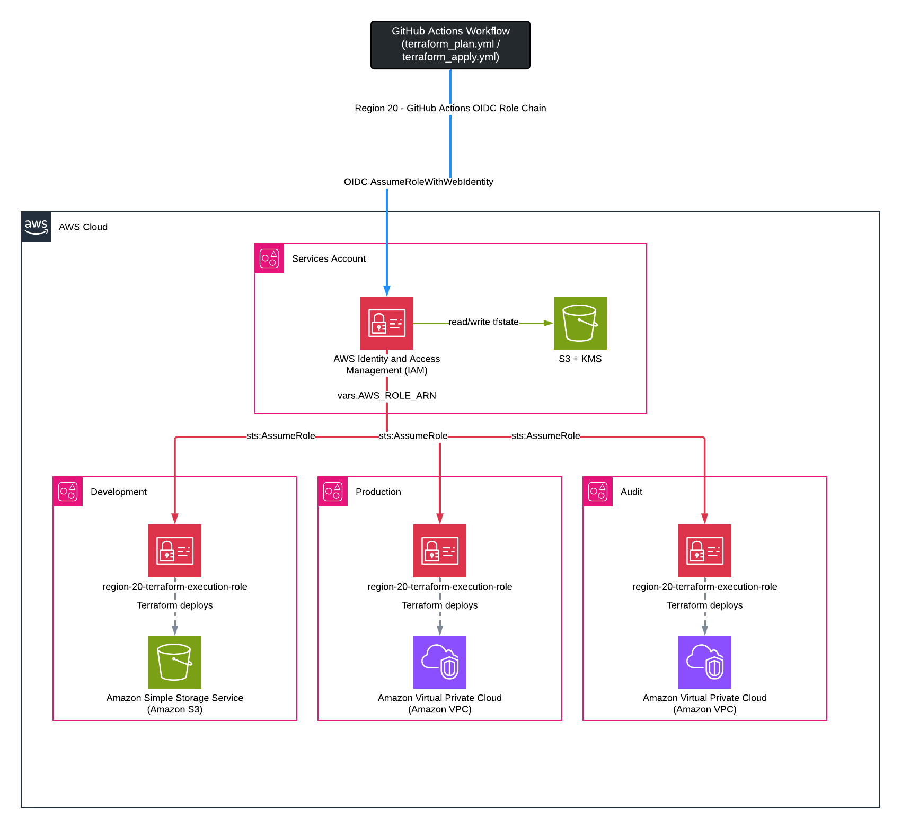

# GitHub Actions OIDC Role Chain

This document explains the authentication model used by every CI workflow in this repository. It is the primary reference for anyone working on CI auth, onboarding a new AWS account, or debugging an `AssumeRole` or `AssumeRoleWithWebIdentity` failure.

The model is a hub-and-spoke assume-role chain: GitHub Actions obtains a short-lived OIDC token, exchanges it for credentials on a single central CI role in the services account, and Terraform itself chain-assumes a dedicated execution role in each target account. No long-lived credentials exist anywhere in this chain.




## The Model at a Glance

A single GitHub OIDC trust lives in the services account. Every workflow run, regardless of which stack or environment it targets, authenticates to the same central CI role. Account isolation is achieved at the Terraform layer: each stack's `providers.tf` contains an `assume_role` block that targets a role named `region-20-terraform-execution-role` in the specific target account selected by `var.account_id`.

This design has a primary benefit. Onboarding a new target account requires no GitHub-side changes, only the execution role needs to be created in the new account.

## Account Topology

| Account | AWS Account ID | Role in This Repo |
|---------|---------------|-------------------|
| Services | `471624149663` | Hosts the central CI role (`region-20-terraform-role`) and the Terraform state S3 bucket. |
| Audit | `627896767065` | Target account for the `audit` stack (`shared` environment in tfvars). |
| Dev | `784590287037` | Target account for the `dev` environment across stacks. |
| Prod | `029750300494` | Target account for the `prod` environment across stacks. |

## The Role Chain Step by Step

1. **OIDC token issuance.** When a workflow job runs, GitHub Actions generates a JWT signed by `token.actions.githubusercontent.com`. The token encodes the repository, ref, and workflow context as claims.

2. **`AssumeRoleWithWebIdentity` into the central CI role.** The `aws-actions/configure-aws-credentials@v4` step exchanges the JWT for temporary AWS credentials on `region-20-terraform-role` (ARN: `arn:aws:iam::471624149663:role/region-20-terraform-role`). This succeeds only if the OIDC provider in the services account exists and the token's claims satisfy the role's trust policy conditions. See [Trust Policies](#trust-policies).

3. **Terraform provider chain-assumes the per-account execution role.** During `terraform init` / `terraform plan` / `terraform apply`, the AWS provider in each stack assumes `region-20-terraform-execution-role` in the target account. The target account is determined by `var.account_id`, which is set per environment in `terraform/<stack>/variables/<env>.tfvars`. The central CI role's credentials are used to call `sts:AssumeRole` on the execution role.

4. **Terraform acts as the execution role.** All API calls that create, update, or read AWS resources are made with the execution role's credentials. The central CI role's credentials are not used beyond the initial `AssumeRole` call.

## GitHub Actions Wiring

The repo variable `AWS_ROLE_ARN` holds the ARN of the central CI role:

```
arn:aws:iam::471624149663:role/region-20-terraform-role
```

Set this at **Settings -> Secrets and variables -> Actions -> Variables** at the repository level. There are **no** per-environment variants (`AWS_ROLE_ARN_dev`, `AWS_ROLE_ARN_prod`, etc.) -- account selection is handled entirely by `account_id` in tfvars.

Each orchestrator workflow (`terraform_base.yml`, `terraform_audit.yml`, `terraform_networking.yml`) reads this variable and forwards it to the reusable plan and apply workflows via a workflow input:

```yaml
env:
  AWS_ROLE_ARN: ${{ vars.AWS_ROLE_ARN }}

jobs:
  generate-matrix:
    outputs:
      AWS_ROLE_ARN: ${{ steps.static-outputs.outputs.AWS_ROLE_ARN }}
    ...

  terraform-plan:
    uses: ./.github/workflows/terraform_plan.yml
    with:
      aws_role_arn: ${{ needs.generate-matrix.outputs.AWS_ROLE_ARN }}
      ...
```

The reusable `terraform_plan.yml` and `terraform_apply.yml` workflows receive `aws_role_arn` as an input and pass it directly to `aws-actions/configure-aws-credentials`:

```yaml
- uses: aws-actions/configure-aws-credentials@v4
  with:
    role-to-assume: ${{ inputs.aws_role_arn }}
    aws-region: ${{ inputs.aws_region }}
```

## Terraform Provider Configuration

Every stack's `providers.tf` follows this pattern:

```hcl
provider "aws" {
  region = var.aws_region

  assume_role {
    role_arn = "arn:aws:iam::${var.account_id}:role/region-20-terraform-execution-role"
  }

  default_tags {
    tags = {
      Environment = var.environment
      Team        = var.team
      ManagedBy   = "Terraform"
      Stack       = "<stack-name>"
    }
  }
}
```

`var.account_id` is declared in `variables.tf` and set in each environment's tfvars file. Switching environments switches which account Terraform deploys into without any workflow change.

## Trust Policies

### Central CI role trust policy (services account)

The OIDC provider is created by the `base` stack (`terraform/base/oidc.tf`). The trust policy it generates trusts GitHub's OIDC issuer, scoped to this repository:

```json
{
  "Version": "2012-10-17",
  "Statement": [{
    "Effect": "Allow",
    "Principal": {
      "Federated": "arn:aws:iam::471624149663:oidc-provider/token.actions.githubusercontent.com"
    },
    "Action": "sts:AssumeRoleWithWebIdentity",
    "Condition": {
      "StringEquals": {
        "token.actions.githubusercontent.com:aud": "sts.amazonaws.com"
      },
      "StringLike": {
        "token.actions.githubusercontent.com:sub": "repo:caylent/region-20-infrastructure:*"
      }
    }
  }]
}
```

The `sub` claim is currently a wildcard (`*`) permitting all refs and workflow contexts. To restrict to specific branches or event types, replace the wildcard with a more specific pattern:

```
# Main branch pushes only:
"repo:caylent/region-20-infrastructure:ref:refs/heads/main"

# Pull requests only:
"repo:caylent/region-20-infrastructure:pull_request"

# Both, using two statement entries or a list value
```

### Per-account execution role trust policy (audit / dev / prod accounts)

Each target account's `region-20-terraform-execution-role` must trust the central CI role:

```json
{
  "Version": "2012-10-17",
  "Statement": [{
    "Effect": "Allow",
    "Principal": {
      "AWS": "arn:aws:iam::471624149663:role/region-20-terraform-role"
    },
    "Action": "sts:AssumeRole"
  }]
}
```

No condition is required here because the central CI role is already scoped to this repository via the OIDC trust in the services account.

## Onboarding a New Account

Adding a new target account (e.g., `staging`) requires no GitHub-side changes.

1. **Create the execution role.** In the new AWS account, create an IAM role named exactly `region-20-terraform-execution-role`. Set its trust policy to allow `sts:AssumeRole` from `arn:aws:iam::471624149663:role/region-20-terraform-role` (the central CI role). Attach the AWS-managed or inline policies that cover the resources the stacks targeting this account will manage.

2. **Create the tfvars file.** For each stack that should deploy into the new account, add a new tfvars file under `terraform/<stack>/variables/<env>.tfvars`. At minimum it must set `account_id` to the new account's ID and `environment` to the env name.

   ```hcl
   environment  = "staging"
   aws_region   = "us-east-1"
   team         = "devops"
   company_name = "region-20"
   account_id   = "<new-account-id>"
   ```

3. **Commit and open a PR.** The environment matrix is built dynamically from tfvars filenames. The new environment appears in plan/apply automatically -- no workflow YAML changes needed.

> The OIDC provider in the services account does not need to be recreated or modified. It was created once by the `base` stack and is shared across all workflows.

## Troubleshooting

### `AccessDenied` on `AssumeRoleWithWebIdentity`

This error occurs at the `aws-actions/configure-aws-credentials` step, before Terraform runs.

**Solutions:**
- Verify the OIDC provider exists in the services account (`arn:aws:iam::471624149663:oidc-provider/token.actions.githubusercontent.com`). It is created by `terraform/base` -- confirm `base` has been applied.
- Check that the `sub` claim condition in the central CI role's trust policy matches the triggering repository and ref. A mismatch (e.g., the workflow runs from a fork, a different repo, or a branch not matched by the pattern) will cause this error.
- Confirm the `aud` condition is `sts.amazonaws.com` and that `aws-actions/configure-aws-credentials@v4` is not overriding the audience.
- Check `vars.AWS_ROLE_ARN` is set and resolves to the correct role ARN. Echo it from the workflow if in doubt.

### `AccessDenied` on the chained `AssumeRole`

This error occurs during `terraform init` or at the first API call, after the central CI role credentials are established.

**Solutions:**
- Verify `region-20-terraform-execution-role` exists in the target account.
- Check that the execution role's trust policy references the central CI role ARN exactly: `arn:aws:iam::471624149663:role/region-20-terraform-role`. A typo or a stale ARN from a previous role name will cause this.
- Confirm `account_id` in the relevant `<env>.tfvars` is correct. An incorrect account ID means the `assume_role` block targets a role ARN in the wrong account.
- If the central CI role has a permissions boundary, verify it allows `sts:AssumeRole`.

### State backend access denied

State is stored in S3 bucket `region-20-tf-state` in the services account, encrypted with KMS key `arn:aws:kms:us-east-1:471624149663:key/77d58064-e84b-4646-ae3d-180ec68f4625`.

**Solutions:**
- The execution role in the target account cannot access this bucket directly -- state access is performed by the central CI role before the provider chain-assumes the execution role. If the backend init step fails, check that the central CI role has `s3:GetObject`, `s3:PutObject`, `s3:ListBucket`, and `kms:Decrypt` / `kms:GenerateDataKey` on the state bucket and key.
- Confirm the `bucket` and `kms_key_id` values in the stack's `terraform.tf` backend block match the services-account bucket and key.
- If using native state locking (`use_lockfile = true`), also ensure `s3:DeleteObject` is permitted on the state key path.

## Related Documentation

- [deployment_with_artifacts.md](deployment_with_artifacts.md) -- full plan-artifact handoff walkthrough and new-stack creation guide
- [terraform_pull_request.md](terraform_pull_request.md) -- PR validation checks that run on every Terraform change
- [README.md](README.md) -- workflow overview and pull-request flow diagrams
